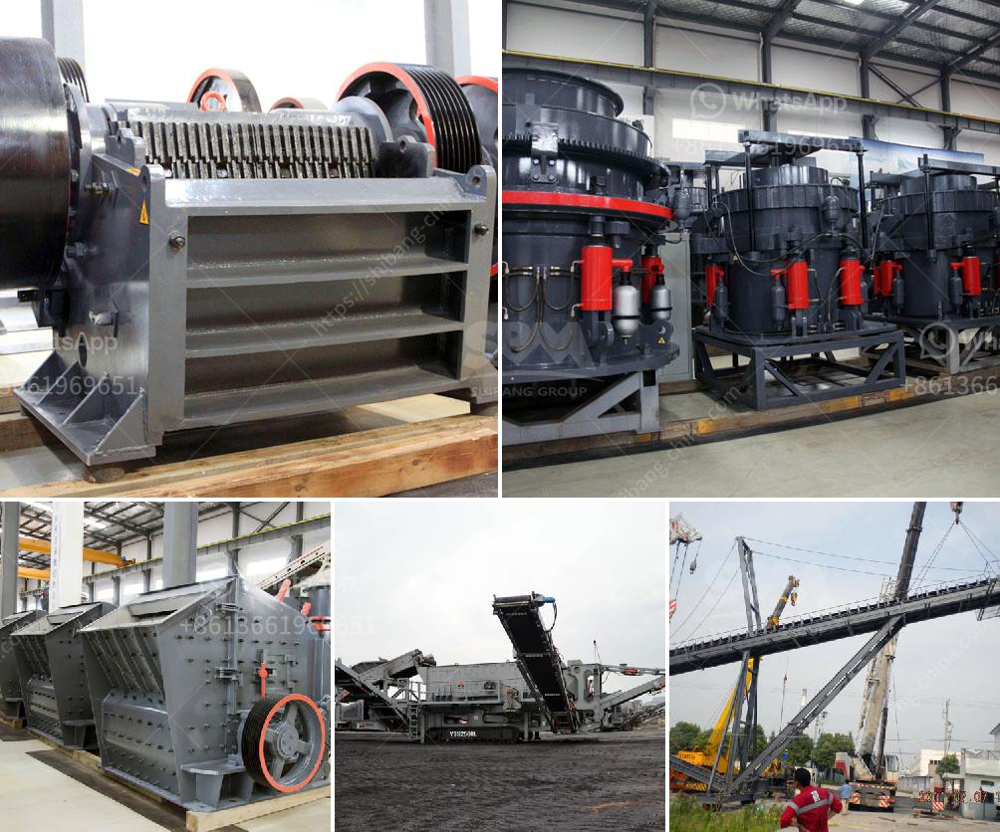

<h3>grinding machine for gypsum powder</h3>
The gypsum powder grinding machine is widely used in the field of mineral processing. It can grind various non-metallic ores with Mohs hardness below 7 and humidity within 6%, such as barite, limestone, dolomite, talc, calcite, gypsum, etc. For the production of gypsum powder, grinding mill is an ideal grinding machine. The equipment is developed by FTM Machinery based on the research and development of milling equipment for many years.

With the continuous improvement of society's awareness of environmental protection, the demand for gypsum powder continues to increase. Gypsum powder has excellent physical and chemical properties, such as fire resistance, sound insulation, and cushioning effect. It is an ideal raw material for construction, building materials, and decoration industries. However, the traditional grinding equipment has many problems, such as low production capacity, high energy consumption, and high maintenance costs.

The gypsum powder grinding machine adopts wind-induced material feeding and pneumatic conveying, which greatly improves the grinding efficiency and saves energy consumption. The equipment is reliable, the operation is simple, and the maintenance is convenient. It mainly consists of a host machine, an analyzer, a blower, and a pipeline device. The dust removal equipment can effectively remove dust during the grinding process, making the workshop clean and environmentally friendly.

The grinding machine for gypsum powder has a complete and scientific system of grinding and processing. The equipment performance is stable and reliable, and the fineness of the finished product can be adjusted arbitrarily between 80-400 mesh. Moreover, the equipment has low noise and low vibration during operation, which greatly improves the working environment.

In conclusion, the gypsum powder grinding machine is an ideal milling equipment for processing minerals. It can effectively improve the grinding efficiency, reduce energy consumption, and create considerable benefits for the gypsum powder industry. With the continuous improvement of technology, the future development trend of gypsum powder grinding machine is promising.
<h3>Contact us</h3><ul><li><strong>Whatsapp:&nbsp;<a href="https://wa.me/8613661969651">+8613661969651</a></strong></li><li><a href="https://swt.shibang-china.com/?git&amp;zhl&amp;grinding machine for gypsum powder"><strong>Online Service(chat now)</strong></a></li></ul><h3>Related</h3><ul><li><a href='china gold water grinding mills.md'>china gold water grinding mills</a></li><li><a href='stone crushers for sale uk finance.md'>stone crushers for sale uk finance</a></li><li><a href='gold wash plant for sale uk.md'>gold wash plant for sale uk</a></li><li><a href='cost of setting up a quarry plant.md'>cost of setting up a quarry plant</a></li><li><a href='tertiary impact crushers for quartz.md'>tertiary impact crushers for quartz</a></li></ul>