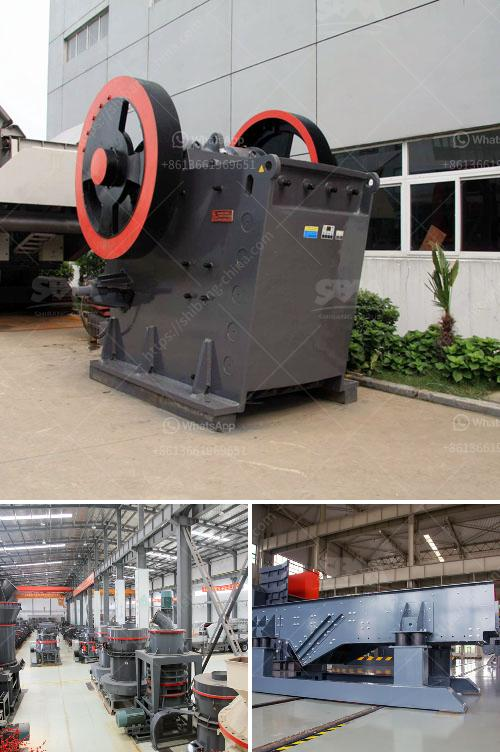

<h3>grinding machine for marble</h3>
The marble grinding machine is a powerful tool for homeowners, contractors, and fabricators alike. It has revolutionized the way marble can be worked on, thus speeding up the process and reducing the manpower needed. The machine can be used for grinding and polishing on the marble surface, and is capable of handling even the most stubborn stains and scratches.

Marble grinding machine offers several advantages to homeowners. Its compact size enables it to fit in small spaces and comes with multiple attachments for various tasks. Whether it is refinishing the floor, removing deep stains, or smoothing out rough patches, the machine is versatile enough to handle it all.

One of the key benefits of the marble grinding machine is the ability to easily select the desired coarseness for the task at hand. Whether you prefer a smooth, polished finish or a more aggressive result, the machine allows you to choose the perfect setting for your needs. This eliminates any guesswork, ensuring that you achieve the desired outcome every time.

Additionally, the machine is designed to be user-friendly, making it ideal for homeowners who want to take charge of their marble maintenance. With simple instructions and minimal maintenance requirements, the grinding machine can be easily operated by anyone. This not only saves money on hiring professional help but also allows for a greater level of control over the process.

Contractors and fabricators also benefit greatly from the use of the marble grinding machine. Its efficiency and speed significantly reduce the time required for each project, allowing them to take on more jobs and increase their profitability. Furthermore, the machine's precise grinding and polishing capabilities ensure a high-quality finish every time, satisfying clients and bolstering their reputation in the industry.

The versatility of the marble grinding machine extends beyond just marble. It can also be used on other stone surfaces like granite and travertine, making it a useful tool for a wide range of applications. Whether it is for residential or commercial purposes, the machine guarantees outstanding results, regardless of the type of stone being worked on.

In conclusion, the marble grinding machine is a great investment for any homeowner or contractor who wants to improve the overall appearance and durability of their marble surfaces. It offers numerous advantages, from its compact size and user-friendly operation to its ability to achieve a wide range of finishes. With this machine at your disposal, you can easily transform dull, worn-out marble into a stunning, polished masterpiece.
<h3>Contact us</h3><ul><li><strong>Whatsapp:&nbsp;<a href="https://wa.me/8613661969651">+8613661969651</a></strong></li><li><a href="https://swt.shibang-china.com/?git&amp;zhl&amp;grinding machine for marble"><strong>Online Service(chat now)</strong></a></li></ul><h3>Related</h3><ul><li><a href='business proposal sample for gold milling.md'>business proposal sample for gold milling</a></li><li><a href='small ball mill for alumina.md'>small ball mill for alumina</a></li><li><a href='stone crusher machines ebay.md'>stone crusher machines ebay</a></li><li><a href='copper processing machine.md'>copper processing machine</a></li><li><a href='how to build a concrete crusher.md'>how to build a concrete crusher</a></li></ul>