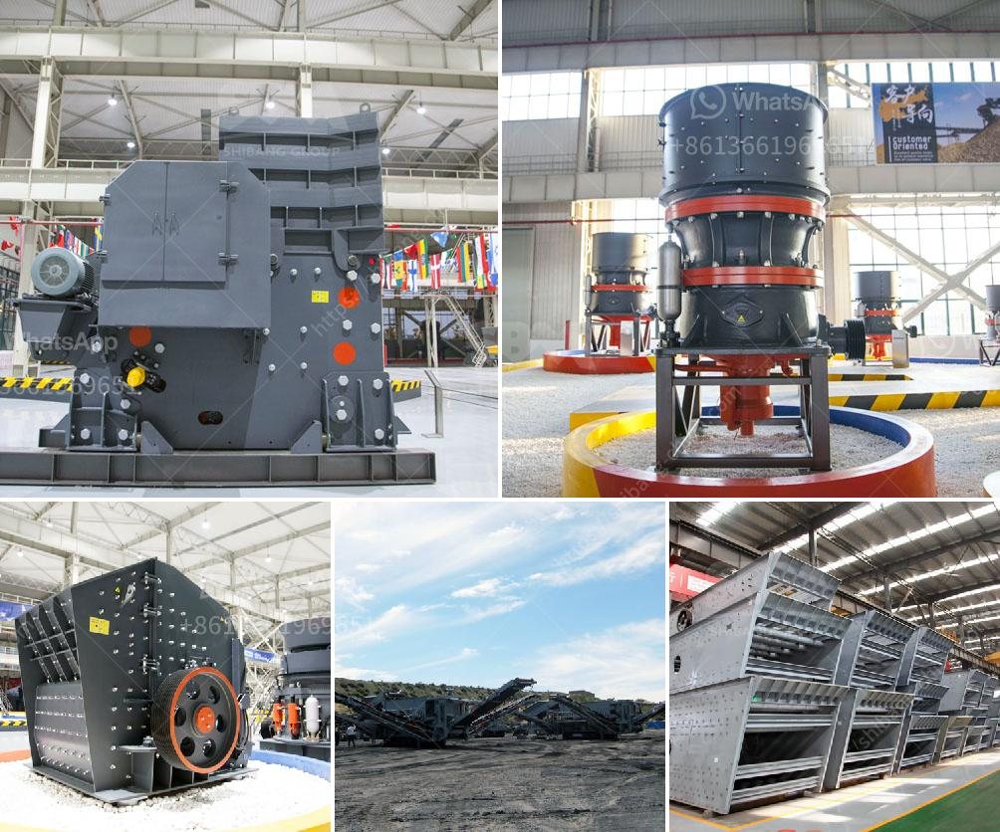

<h3>grinding machine in greece</h3>
In recent years, Greece has taken significant strides in advancing its industrial sectors, including the manufacturing and machinery segment. One vital component that has played a pivotal role in this growth is the grinding machine industry. Grinding machines are intricate tools utilized for precision cutting, shaping, and polishing of various materials, from metals to woods. These versatile machines have become invaluable in Greece's manufacturing landscape due to their efficiency, accuracy, and numerous applications across diverse industries.

Greece boasts a long-standing tradition in machine tool manufacturing, dating back to the early 20th century. Over the years, the country's engineers and manufacturers have developed a deep understanding of this specialized field, resulting in the production of cutting-edge grinding machines that meet the specific needs of the domestic and international markets. Greek grinding machines are highly regarded globally and are known for their reliability, durability, and exceptional performance.

The presence of a robust grinding machine industry in Greece has contributed significantly to the overall economic growth and competitiveness of the nation. One of the primary reasons for this is the industry's strong collaboration with other manufacturing sectors, such as automotive, aerospace, and energy. Grinding machines play a crucial role in manufacturing critical components for these industries, including engine parts, turbine blades, and precision gears. The high precision and accuracy achieved through grinding processes ensure the quality and reliability of these components, ultimately enhancing the overall performance of the end products.

Furthermore, the grinding machine industry in Greece has also contributed to the development of cutting-edge technologies and machinery. Greek manufacturers continuously invest in research and development to improve the efficiency and effectiveness of their grinding machines. This focus on innovation has resulted in the creation of advanced grinding technologies, such as computer numerical control (CNC) systems and robotic automation. These advancements have not only elevated the productivity levels of Greek manufacturers but have also positioned the country as a global leader in precision machining solutions.

Moreover, the rising demand for Greek grinding machines has led to job creation and employment opportunities within the manufacturing sector. Skilled engineers, technicians, and machine operators are integral to the functioning of the grinding machine industry. The industry's growth has stimulated job creation and has contributed to reducing unemployment rates in Greece. The presence of a strong grinding machine industry has also fostered collaborations with educational institutions and vocational schools, ensuring the continuous supply of skilled labor for the sector.

The growth of the grinding machine industry in Greece has not been without challenges. The global economic downturn and subsequent financial crises posed significant difficulties for the manufacturing sector, including the grinding machine domain. However, Greek manufacturers' resilience and commitment to quality have ensured the industry's steady recovery and subsequent growth.

In conclusion, the grinding machine industry in Greece has emerged as a key component of economic growth and industrial development. Through precision cutting, shaping, and polishing processes, these machines have enabled Greek manufacturers to meet the demands of diverse industries and produce high-quality components. With ongoing investments in research and development and collaborations with other sectors, the Greek grinding machine industry is set to continue its trajectory of growth, further contributing to the nation's economic prosperity.
<h3>Contact us</h3><ul><li><strong>Whatsapp:&nbsp;<a href="https://wa.me/8613661969651">+8613661969651</a></strong></li><li><a href="https://swt.shibang-china.com/?git&amp;zhl&amp;grinding machine in greece"><strong>Online Service(chat now)</strong></a></li></ul><h3>Related</h3><ul><li><a href='100 tph stone crusher plant specifications.md'>100 tph stone crusher plant specifications</a></li><li><a href='shafts for hammer mills.md'>shafts for hammer mills</a></li><li><a href='mobile crusher hire durban.md'>mobile crusher hire durban</a></li><li><a href='jaw crusher manufacturer in china.md'>jaw crusher manufacturer in china</a></li><li><a href='calcium carbonate grinding plant feasibility.md'>calcium carbonate grinding plant feasibility</a></li></ul>