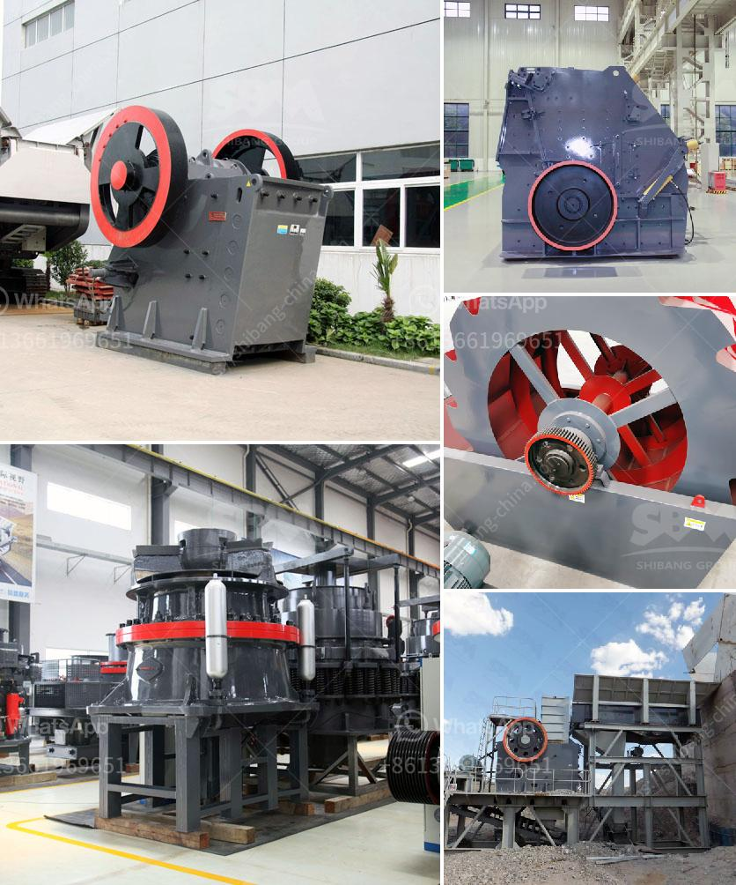

<h3>grinding machine manufacturers ethiopia</h3>
Grinding machines are widely used in various industries to grind and shape different materials. Ethiopia is one of the fastest-growing economies in Africa and with the increase in industrialization, there has been a significant demand for grinding machines.

The country has a strong manufacturing base and a high level of technological advancement, which has attracted many multinational companies to set up their manufacturing plants in Ethiopia. As a result, there is a growing need for grinding machine manufacturers in the country to meet this demand.

Grinding machines are used for a variety of purposes such as grinding and polishing surfaces, producing smooth finishes on metal surfaces, removing unwanted material, and sharpening blades. These machines are essential in industries such as construction, automobile, aerospace, and shipbuilding, where precision and accuracy are of utmost importance.

Ethiopia has a well-established infrastructure, including road networks and ports, which makes it easier for manufacturers to import and export their products. This has further contributed to the growth of the manufacturing sector in the country.

Grinding machine manufacturers in Ethiopia are now able to produce a wide range of grinding machines with advanced capabilities. These machines are equipped with modern technologies such as computer numerical control (CNC), which enables them to produce high-quality and precise results.

Additionally, the availability of skilled labor in Ethiopia has also played a crucial role in the growth of grinding machine manufacturers. The country has a large population of young and skilled workers who are trained in various technical disciplines, including machine operation and maintenance.

Furthermore, the Ethiopian government has been actively promoting the manufacturing sector by offering incentives and tax benefits to attract more foreign investment. This has encouraged many grinding machine manufacturers to set up their manufacturing plants in the country, creating employment opportunities and boosting the economy.

In conclusion, grinding machine manufacturers in Ethiopia are experiencing a growing demand for their products due to the country's industrialization and modernization efforts. The government's support and the availability of skilled labor have further contributed to the success of these manufacturers. As Ethiopia continues to attract foreign investment and strengthen its manufacturing sector, the demand for grinding machines is expected to rise even further in the coming years.
<h3>Contact us</h3><ul><li><strong>Whatsapp:&nbsp;<a href="https://wa.me/8613661969651">+8613661969651</a></strong></li><li><a href="https://swt.shibang-china.com/?git&amp;zhl&amp;grinding machine manufacturers ethiopia"><strong>Online Service(chat now)</strong></a></li></ul><h3>Related</h3><ul><li><a href='mobile crushers hire in south africa.md'>mobile crushers hire in south africa</a></li><li><a href='silica sand production using ball mill in dubai.md'>silica sand production using ball mill in dubai</a></li><li><a href='gypsum plant unit and utilities.md'>gypsum plant unit and utilities</a></li><li><a href='portable crushing.md'>portable crushing</a></li><li><a href='rudra industries ball mill manufacturers.md'>rudra industries ball mill manufacturers</a></li></ul>