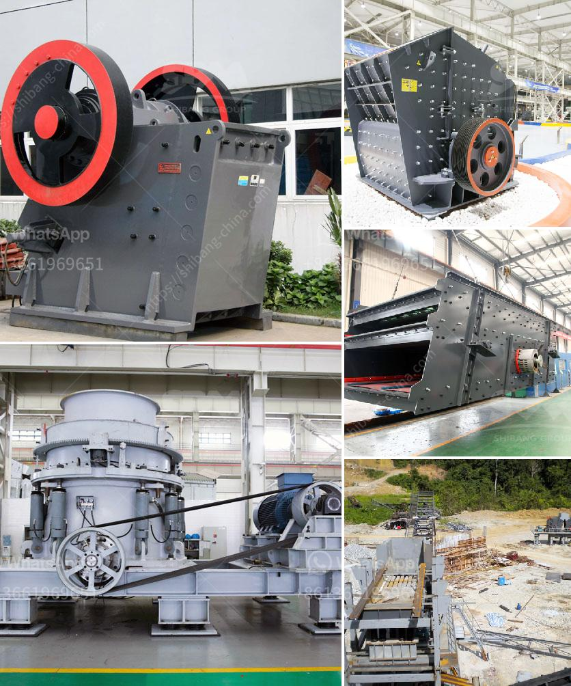

<h3>grinding machine palletsgrinding machine palvisor</h3>
Grinding machines are an essential piece of equipment in the manufacturing industry. They are used to remove excess material from a workpiece, creating a precise and smooth finish. Among the various types of grinding machines available, the pallet grinding machine stands out for its efficiency and versatility.

A pallet grinding machine, also known as a palvisor, is specifically designed to grind or sand the surface of wooden pallets. Pallets are widely used in industries for transportation and storage purposes, and over time, they tend to wear out and accumulate dirt and debris. The palvisor provides a solution to this problem by effectively rejuvenating these worn-out pallets.

The palvisor consists of a rotating abrasive wheel or belt that grinds against the surface of the pallet, removing any irregularities and creating a smoother finish. This process not only enhances the aesthetics of the pallet but also improves its functionality by eliminating any potential hazards.

One of the main advantages of using a pallet grinding machine is its ability to handle a wide range of pallet sizes and materials. Whether it is a standard-sized pallet or a custom-designed one, the palvisor can adapt to the specific requirements, ensuring a consistent result every time. Additionally, it can handle different types of wood, such as hardwood or softwood, without compromising on the quality of the finish.

Moreover, the pallet grinding machine offers an efficient and time-saving solution. With its automated operation, it can quickly process multiple pallets in a short amount of time, increasing productivity in the manufacturing process. Furthermore, the palvisor can also be programmed to achieve different grinding profiles, allowing manufacturers to customize the finish based on their specific needs.

In conclusion, the grinding machine pallets, also known as pallet grinding machines or palvisors, are an invaluable asset in the manufacturing industry. They offer a versatile and efficient solution for rejuvenating and enhancing the functionality of wooden pallets. With their ability to handle various sizes and types of pallets, as well as provide automated and customizable grinding profiles, they are a valuable addition to any production line.
<h3>Contact us</h3><ul><li><strong>Whatsapp:&nbsp;<a href="https://wa.me/8613661969651">+8613661969651</a></strong></li><li><a href="https://swt.shibang-china.com/?git&amp;zhl&amp;grinding machine palletsgrinding machine palvisor"><strong>Online Service(chat now)</strong></a></li></ul><h3>Related</h3><ul><li><a href='gypsum manufacturing process.md'>gypsum manufacturing process</a></li><li><a href='crusher machine from south korea.md'>crusher machine from south korea</a></li><li><a href='start up granite quarry business.md'>start up granite quarry business</a></li><li><a href='small stone crusher machine in italy.md'>small stone crusher machine in italy</a></li><li><a href='crusher plant equipment.md'>crusher plant equipment</a></li></ul>