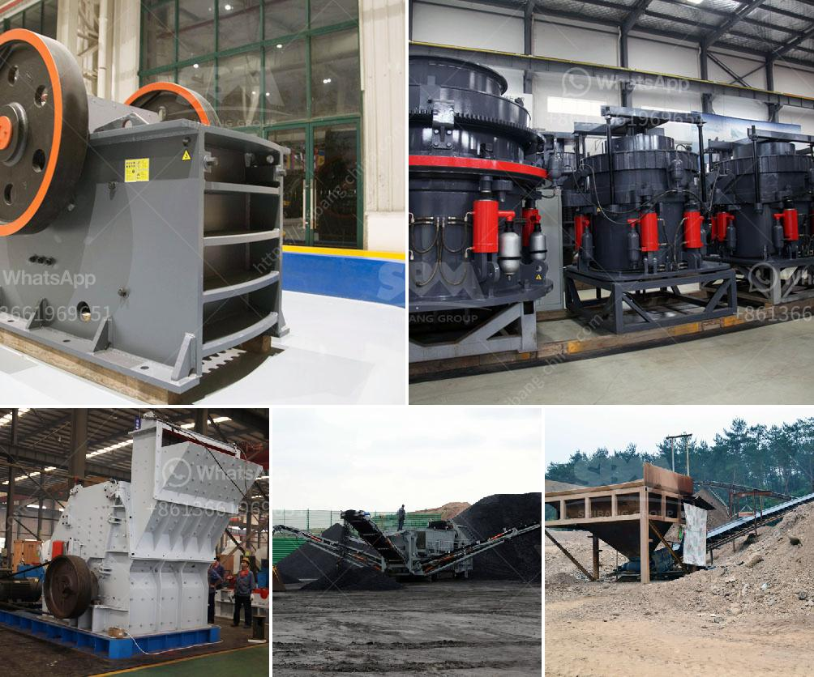

<h3>grinding mill for quartz in to 500 mesh in india</h3>
Quartz is a hard, crystalline mineral that is abundantly found in nature. Its unique properties such as high durability, resistance to heat, and electrical conductivity have made it highly sought after in various industries. In order to utilize quartz to its fullest potential, it needs to be broken down into smaller particles. This is where grinding mills come into play.

A grinding mill is a specialized piece of equipment used to break down materials into fine particles. These machines are widely used in industries such as mining, cement, ceramics, and construction. One of the materials that can be processed with a grinding mill is quartz.

In India, quartz is widely available and is commonly used in various applications such as construction materials, ceramics, and glass manufacturing. To use quartz in these industries, it needs to be ground down into a fine powder. This is where a grinding mill comes in.

Grinding mills are available in various sizes and capacities to suit different grinding requirements. For grinding quartz, a grinding mill with a size range of 300-500 mesh is commonly used. The mill grinds the material into a fine powder, which is then used in various applications.

There are several types of grinding mills that can be used for quartz grinding. One common type is the ball mill, which is typically used for coarse and fine grinding of quartz. The ball mill uses a cylindrical grinding chamber with hardened steel balls and rotates at a speed that causes the balls to fall back into the cylinder and onto the material to be ground. The grinding action of the balls helps break down the quartz into smaller particles.

Another type of grinding mill commonly used for quartz grinding is the Raymond mill. This mill has a rotating shaft with flat steel blades that grind the material between a stationary grinding ring and a rotating grinding roller. The high-pressure air generated by the blower in the mill helps to carry the ground material upwards and into a classifier, which separates the fine particles from the coarse ones.

In addition to these types of grinding mills, there are also specialized mills available for specific applications. For example, jet mills use high-pressure air or steam to grind particles down to a fine powder. These mills are often used for ultra-fine grinding of quartz.

Grinding mills for quartz are available in various capacities and price ranges depending on the specific needs of the application. In India, there are several manufacturers and suppliers of grinding mills who offer competitive prices and high-quality products.

In conclusion, grinding mills are an essential piece of equipment for processing quartz into fine powder. These machines help break down the quartz into smaller particles, making it suitable for various applications in industries such as construction, ceramics, and glass manufacturing. With a wide range of options available, manufacturers in India offer grinding mills for quartz in different capacities and price ranges, ensuring that customers can find the right solution for their specific needs.
<h3>Contact us</h3><ul><li><strong>Whatsapp:&nbsp;<a href="https://wa.me/8613661969651">+8613661969651</a></strong></li><li><a href="https://swt.shibang-china.com/?git&amp;zhl&amp;grinding mill for quartz in to 500 mesh in india"><strong>Online Service(chat now)</strong></a></li></ul><h3>Related</h3><ul><li><a href='mobile stone crushers.md'>mobile stone crushers</a></li><li><a href='ball mill maintenance seminar.md'>ball mill maintenance seminar</a></li><li><a href='stone cutting machine in india.md'>stone cutting machine in india</a></li><li><a href='mobile jaw crusher for sale india used price.md'>mobile jaw crusher for sale india used price</a></li><li><a href='crush plant prices in pakistan.md'>crush plant prices in pakistan</a></li></ul>