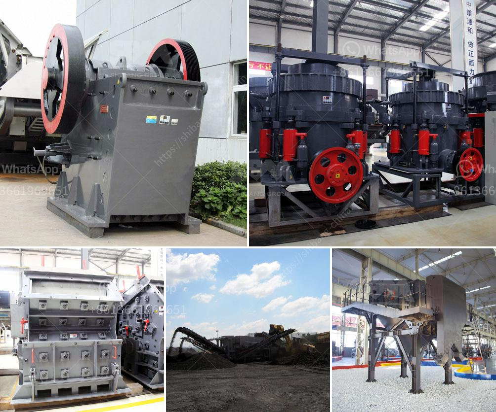

<h3>grinding mill machines in south africa</h3>
Grinding mill machines have gained a significant popularity in South Africa as they are able to process a wide range of materials including minerals, ores, and even food products. With the increasing demand for grinding mill machines, there is a wide variety of options available on the market, offering different sizes, designs, and functionalities. However, when it comes to choosing the right grinding mill machine for your specific needs, there are several factors to consider.

One of the most important factors is the capacity of the grinding mill machine. The capacity determines the amount of material that can be processed at a given time and is usually measured in tonnes per hour. Depending on your production requirements, you need to select a machine that can handle the desired capacity. For smaller operations or labs, a smaller capacity machine may be sufficient, whereas larger industrial applications may require higher capacities.

Another factor is the type of material being processed. Grinding mill machines are designed to process different types of materials, including minerals, ores, and food products. The type of material being processed will determine the type of grinding mill machine needed, as different materials require different grinding mechanisms. For example, minerals and ores may require a machine with a high impact force to break down the particles, while food products may require a machine with a gentler grinding action to maintain the integrity of the product.

The size of the grinding mill machine is also an important consideration. The size of the machine will determine its portability, as well as the space required for installation. Depending on the available space and the intended use of the machine, you may choose a compact and portable machine or a larger, stationary machine.

Another important factor to consider is the ease of use and maintenance of the grinding mill machine. A machine that is easy to use and maintain will save you time and effort in the long run. Look for features such as user-friendly controls, easy access to the grinding chamber for cleaning and maintenance, and availability of spare parts and service support.

In South Africa, there are various suppliers offering a wide range of grinding mill machines. Some of the popular brands include SKD, LM, and FTM. These brands offer a range of grinding mill machines suitable for different applications. To make an informed decision, it is recommended to compare the features, specifications, and prices of different machines before making a purchase.

In conclusion, grinding mill machines are essential equipment in South Africa, where the mining industry is flourishing. As the demand for grinding mill machines continues to grow in different industries, the market is likely to witness a steady growth over the coming years. By considering factors such as capacity, material compatibility, size, ease of use, and maintenance, one can choose the right grinding mill machine for their specific needs.
<h3>Contact us</h3><ul><li><strong>Whatsapp:&nbsp;<a href="https://wa.me/8613661969651">+8613661969651</a></strong></li><li><a href="https://swt.shibang-china.com/?git&amp;zhl&amp;grinding mill machines in south africa"><strong>Online Service(chat now)</strong></a></li></ul><h3>Related</h3><ul><li><a href='copper processing machine.md'>copper processing machine</a></li><li><a href='how to calculate crushing plant efficency.md'>how to calculate crushing plant efficency</a></li><li><a href='sand washing machine price.md'>sand washing machine price</a></li><li><a href='crusher for construction price.md'>crusher for construction price</a></li><li><a href='stone crusher plant made in pakistan price.md'>stone crusher plant made in pakistan price</a></li></ul>