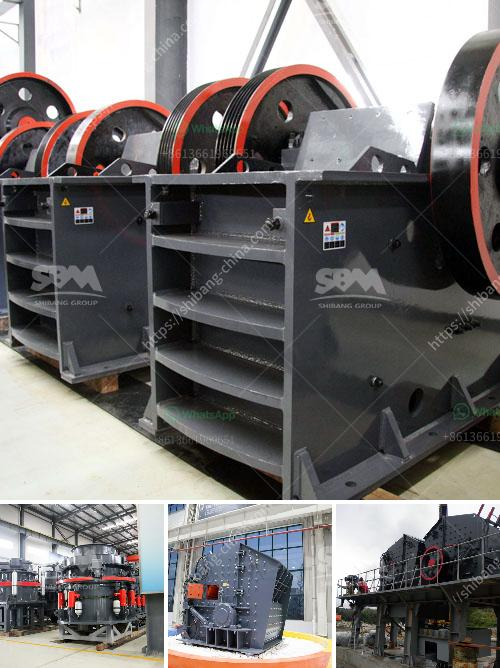

<h3>grinding mill prices in south africa</h3>
Grinding mill prices in South Africa have been one of the major concerns for many customers. Farmers, agricultural workers, and residents in rural areas have to always ensure that they have access to affordable milling equipment. Fortunately, as the leading supplier of mills in South Africa, ABC Hansen, understands the unique needs of various customers, which is why they offer highly competitive grinding mill prices.

With the ever-increasing cost of living in South Africa, including rising food prices, it has become essential for individuals and communities to become more self-sufficient. This has led to a surge in demand for affordable, durable, and efficient grinding mills.

ABC Hansen offers a wide range of grinding mills to cater to different milling needs. Whether you're grinding grains for animal feed, maize for mealie meal, or any other type of milling, their mills are designed to deliver optimal performance. From small-scale maize mills to large industrial mills, ABC Hansen ensures that their grinding mill prices are competitive and affordable.

In addition to competitive pricing, ABC Hansen also offers after-sales service and support to ensure customers get the most out of their mills. This includes troubleshooting, technical advice, and genuine spare parts to keep the mills running smoothly.

By offering affordable grinding mill prices, ABC Hansen is not only supporting individuals and communities in South Africa but also contributing to the overall economic growth of the country. Through reliable milling equipment, they enable customers to generate income, create employment opportunities, and improve food security.

In conclusion, grinding mill prices in South Africa have been a concern for many, but ABC Hansen understands the importance of affordable milling equipment. With their range of mills and competitive pricing, they are helping individuals and communities become more self-sufficient and contribute to the growth of the country.
<h3>Contact us</h3><ul><li><strong>Whatsapp:&nbsp;<a href="https://wa.me/8613661969651">+8613661969651</a></strong></li><li><a href="https://swt.shibang-china.com/?git&amp;zhl&amp;grinding mill prices in south africa"><strong>Online Service(chat now)</strong></a></li></ul><h3>Related</h3><ul><li><a href='quarry equipment for sale in indonesia.md'>quarry equipment for sale in indonesia</a></li><li><a href='2nd hand crushers thailand.md'>2nd hand crushers thailand</a></li><li><a href='sewa rental stone crusher.md'>sewa rental stone crusher</a></li><li><a href='bauxite production line.md'>bauxite production line</a></li><li><a href='smallest cement plant.md'>smallest cement plant</a></li></ul>