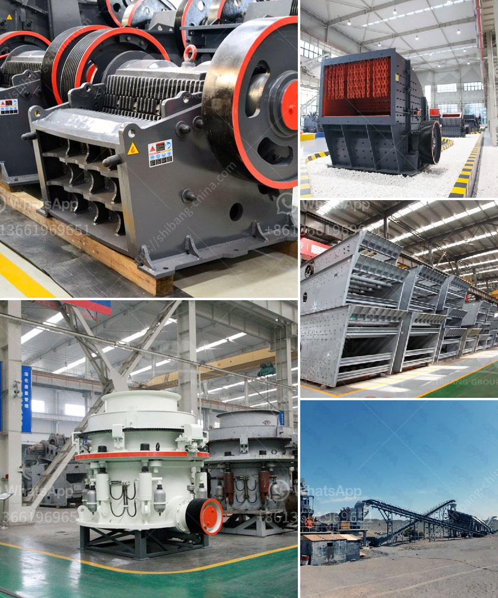

<h3>grinding mill thrust pad gearbox</h3>
A grinding mill thrust pad gearbox is an essential component of any grinding mill machine. It consists of a set of bearings and gears that work together to keep the mill running smoothly and efficiently. The thrust pad gearbox is responsible for transferring the rotational motion from the motor to the grinding stone, ensuring that the stone turns at the desired speed and direction.

One of the crucial components of the thrust pad gearbox is the thrust pad. This pad is usually made of a durable material like bronze or steel and is designed to withstand the immense pressure and load placed on it during the grinding process. It acts as a cushion between the gears, absorbing any shock or impact that may occur during operation.

The gearbox also plays a critical role in ensuring that the grinding mill operates at its optimum performance levels. It provides the necessary torque and power to drive the grinding stone, allowing it to crush and grind the materials effectively. Additionally, the gearbox is designed to accommodate various speeds and rotational directions, making it versatile for different milling applications.

To maximize the lifespan and efficiency of the grinding mill thrust pad gearbox, regular maintenance and lubrication are necessary. The gears should be properly cleaned and inspected, and the bearings should be greased to prevent friction and wear. Any signs of damage or wear should be addressed promptly to avoid further complications and ensure the smooth operation of the mill.

In conclusion, the grinding mill thrust pad gearbox is an integral part of any grinding mill machine. It is responsible for transmitting the rotational motion from the motor to the grinding stone, ensuring that it operates at its peak performance levels. Regular maintenance and lubrication are crucial for extending its lifespan and ensuring the longevity of the grinding mill.
<h3>Contact us</h3><ul><li><strong>Whatsapp:&nbsp;<a href="https://wa.me/8613661969651">+8613661969651</a></strong></li><li><a href="https://swt.shibang-china.com/?git&amp;zhl&amp;grinding mill thrust pad gearbox"><strong>Online Service(chat now)</strong></a></li></ul><h3>Related</h3><ul><li><a href='portable crushing and screening.md'>portable crushing and screening</a></li><li><a href='industrial grinder fine powder.md'>industrial grinder fine powder</a></li><li><a href='chrome mining methods in zimbabwe.md'>chrome mining methods in zimbabwe</a></li><li><a href='bentonite pulverizer.md'>bentonite pulverizer</a></li><li><a href='different types of vibrating screen.md'>different types of vibrating screen</a></li></ul>