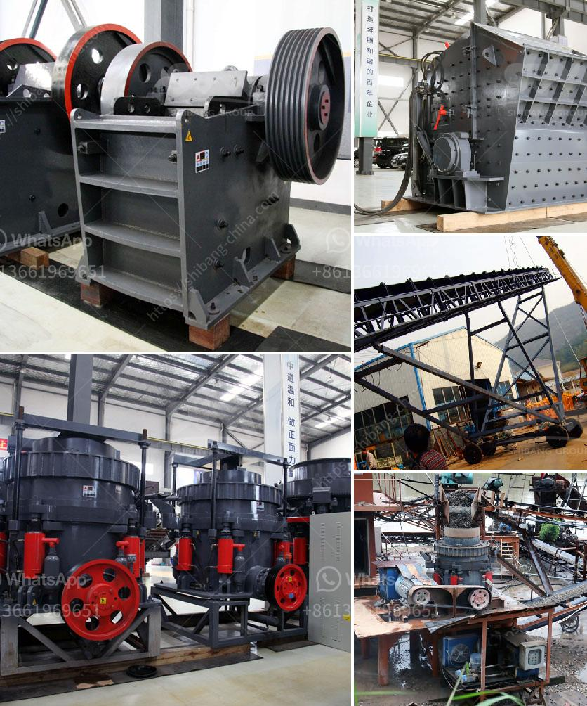

<h3>grinding mill usa</h3>
In the fast-paced world of industrial manufacturing, grinding mills play a crucial role in the production process. These cutting-edge machines are responsible for reducing raw materials into smaller, more manageable sizes, thereby enabling further processing and enhancing overall productivity. In the United States, the grinding mill industry has witnessed significant advancements in technology, leading to more efficient and precise milling operations.

One of the key factors behind the success of grinding mills in the USA is the development of innovative materials and designs. The use of high-quality materials ensures durability and longevity, while advanced designs improve performance and reduce downtime. For instance, many grinding mills now incorporate wear-resistant liners that not only extend the lifespan of the machines but also enhance their overall efficiency. These liners are designed to withstand the abrasive nature of various materials, thereby reducing the need for frequent replacements and maintenance.

Furthermore, the technological advancements in grinding mill motors have revolutionized milling operations in the United States. Many modern mills now employ high-performance motors that deliver higher torque and power while consuming less energy. This not only reduces the overall electricity consumption but also contributes to cost savings for manufacturers. Additionally, these advanced motors offer better control and precision, allowing operators to adjust the speed and intensity of the grinding process based on specific requirements.

The advent of automation technology has also transformed the grinding mill industry in the USA. Intelligent control systems and robotics have made it possible to monitor and adjust mill operations in real-time, resulting in improved efficiency and accuracy. Automated grinding mills are capable of continuously optimizing the milling process, ensuring consistent particle sizes and minimal wastage. Moreover, the integration of data analytics and machine learning algorithms has enabled predictive maintenance, wherein potential issues and failures can be identified before they cause significant downtime.

In recent years, environmental sustainability has become a top priority for many industries, including manufacturing. In response to this growing concern, grinding mill manufacturers in the USA have focused on developing eco-friendly solutions. For instance, some mills now feature dust collection systems that effectively capture and remove harmful particulates, preventing air pollution. Additionally, advanced filtration systems are employed to minimize the release of pollutants into the surrounding environment.

The grinding mill industry in the USA continues to thrive due to the constant drive for technological advancements. Engineers and manufacturers are continually pushing boundaries, experimenting with new materials, designs, and automated systems to optimize milling operations. This results in increased productivity, reduced energy consumption, and improved precision, ultimately benefiting both manufacturers and the environment.

In conclusion, grinding mills have come a long way in the USA, evolving from basic machines to highly advanced and efficient industrial tools. The adoption of cutting-edge materials, innovative designs, and automation technology has revolutionized milling operations across various industries. As manufacturers continue to prioritize sustainability, grinding mills will play a vital role in shaping a greener and more efficient future for the USA's manufacturing sector.
<h3>Contact us</h3><ul><li><strong>Whatsapp:&nbsp;<a href="https://wa.me/8613661969651">+8613661969651</a></strong></li><li><a href="https://swt.shibang-china.com/?git&amp;zhl&amp;grinding mill usa"><strong>Online Service(chat now)</strong></a></li></ul><h3>Related</h3><ul><li><a href='price of grinder machine in bangladesh.md'>price of grinder machine in bangladesh</a></li><li><a href='clay crusher processing in india.md'>clay crusher processing in india</a></li><li><a href='ball mill diagram for cement grinding.md'>ball mill diagram for cement grinding</a></li><li><a href='china grove roller mill.md'>china grove roller mill</a></li><li><a href='sewa rental stone crusher.md'>sewa rental stone crusher</a></li></ul>