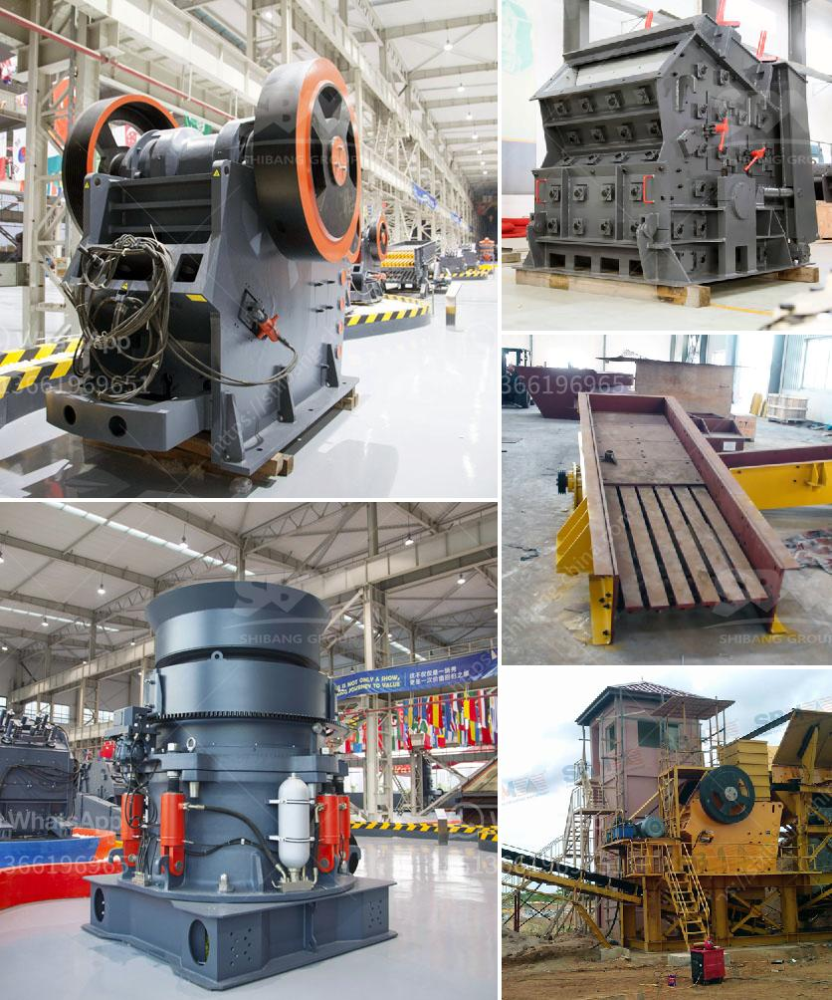

<h3>grinding of copper ores</h3>
Grinding of copper ores is a crucial step in the extraction process of this metal. Copper ore is crushed into small particles and then ground to ensure efficient extraction of copper. Grinding also helps to blend the ore into a uniform mixture for further processing.

The grinding process involves using a mill to break the ore into smaller pieces, reducing the size of particles, and exposing the copper mineral within. This process is necessary to liberate the copper minerals from the surrounding gangue material.

One of the primary reasons for grinding copper ores is to increase the surface area of the ore particles. By reducing the size of the particles, more surface area is available for the chemical reactions involved in copper extraction. This allows the leaching solution to dissolve the copper minerals more efficiently.

Grinding copper ore also helps in obtaining a consistent particle size, which is essential for succeeding stages of the extraction process. A uniform particle size ensures that the leaching process operates smoothly and produces a high yield of copper.

There are various techniques and equipment used for grinding copper ores. Ball mills, rod mills, and autogenous mills are some commonly used grinding equipment. These mills utilize different mechanisms to break the ore into smaller particles.

The grinding process can consume a significant amount of energy. To optimize the process and minimize energy consumption, it is crucial to choose the right type of grinding equipment and operating conditions. Factors such as ore hardness, desired particle size, and throughput capacity determine the selection of grinding equipment.

In conclusion, grinding of copper ores plays a vital role in the extraction process of copper. It helps to increase the surface area of the ore particles, allowing for efficient leaching and maximum copper recovery. The grinding process also ensures a uniform particle size, which is important for subsequent stages of copper extraction. With proper selection of grinding equipment and operating conditions, the process can be optimized to minimize energy consumption and maximize productivity.
<h3>Contact us</h3><ul><li><strong>Whatsapp:&nbsp;<a href="https://wa.me/8613661969651">+8613661969651</a></strong></li><li><a href="https://swt.shibang-china.com/?git&amp;zhl&amp;grinding of copper ores"><strong>Online Service(chat now)</strong></a></li></ul><h3>Related</h3><ul><li><a href='cost of quarry crusher machines.md'>cost of quarry crusher machines</a></li><li><a href='stone crusher machine rentals in ghana.md'>stone crusher machine rentals in ghana</a></li><li><a href='how to build a concrete crusher.md'>how to build a concrete crusher</a></li><li><a href='marble mining equipments.md'>marble mining equipments</a></li><li><a href='grinding mill machines in south africa.md'>grinding mill machines in south africa</a></li></ul>