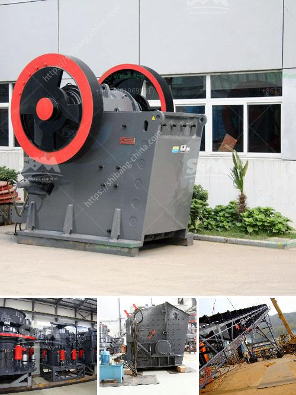

<h3>grinding roller mills manufacturer from china</h3>
China, known as the manufacturing hub for a diverse range of industries, has been making remarkable strides in the field of grinding roller mills. These mills have revolutionized the grinding industry, particularly in the mining and cement sectors, by providing efficient and cost-effective solutions for grinding various materials.

A grinding roller mill is a large cylindrical machine used to grind raw materials into fine powders. It consists of a series of rollers that revolve around a central axis, crushing and grinding the materials between them. Roller mills are widely used in the production of cement, mining, metallurgy, chemical industry, and many other sectors where large-scale grinding is required.

In recent years, Chinese manufacturers have emerged as leaders in the production of grinding roller mills. These manufacturers have invested heavily in research and development to ensure their mills deliver high performance and reliability. With advanced technology and innovative design, Chinese grinding roller mills have gained immense popularity worldwide.

Chinese manufacturers take pride in providing their customers with the best quality products. They use high-quality materials and modern production techniques to manufacture grinding roller mills that are durable and long-lasting. These mills feature efficient grinding mechanisms that significantly reduce energy consumption and operating costs. By focusing on energy efficiency, Chinese manufacturers contribute to sustainable development and environmental protection.

Furthermore, Chinese manufacturers also offer customized grinding roller mills to meet the unique requirements of different industries. Whether it is a specific size, capacity, or grinding material, these manufacturers have the expertise to tailor their mills accordingly. This customization capability has earned them a trusted reputation among customers worldwide.

The increasing demand for grinding roller mills from China reflects the industry's confidence in their products. Chinese manufacturers have set new benchmarks in terms of quality, efficiency, and cost-effectiveness. They continue to innovate and push the boundaries of what is possible, ensuring that the grinding industry remains at the forefront of technological advancements.

In conclusion, Chinese manufacturers of grinding roller mills have established themselves as leaders in the industry. Their commitment to quality, innovation, and customization has revolutionized the grinding industry. With their efficient and cost-effective solutions, these manufacturers are driving the growth of various sectors, making a significant impact on the global market. As the demand for grinding roller mills continues to rise, China remains at the forefront, continuously pushing the boundaries of this essential technology.
<h3>Contact us</h3><ul><li><strong>Whatsapp:&nbsp;<a href="https://wa.me/8613661969651">+8613661969651</a></strong></li><li><a href="https://swt.shibang-china.com/?git&amp;zhl&amp;grinding roller mills manufacturer from china"><strong>Online Service(chat now)</strong></a></li></ul><h3>Related</h3><ul><li><a href='gypsum milling prices in kenya.md'>gypsum milling prices in kenya</a></li><li><a href='stone crusher price list 300 tonnes capacity per hour.md'>stone crusher price list 300 tonnes capacity per hour</a></li><li><a href='price of gypsum processing plant.md'>price of gypsum processing plant</a></li><li><a href='cement vertical roller mill.md'>cement vertical roller mill</a></li><li><a href='chromite ore flowsheet pdf.md'>chromite ore flowsheet pdf</a></li></ul>