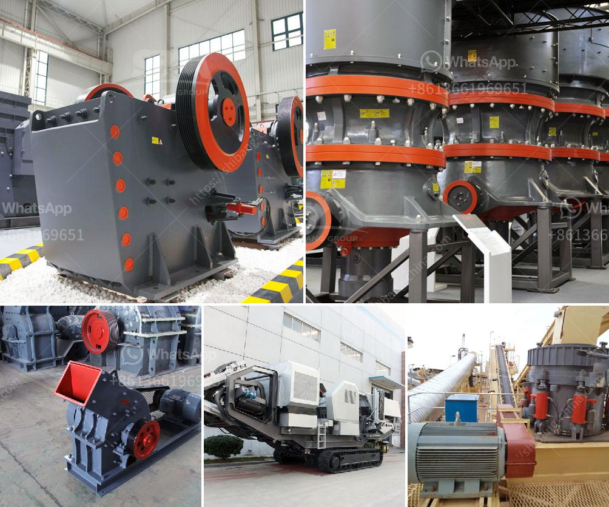

<h3>grinding silica sand process</h3>
Silica sand is a vital industrial mineral used in various applications, such as making glass, filling molds, casting metals, and many more. To produce high-quality silica sand, grinding is an essential process. In this article, we will discuss the importance of grinding in the silica sand manufacturing process and the various methods used.

Grinding is the process of breaking down the silica sand particles into smaller sizes by using a machine. Crushing and grinding are two primary processes used to reduce the size of silica sand particles. Crushing involves using mechanical forces to break down the particles into smaller sizes, while grinding uses abrasive mechanisms to achieve the same goal.

The grinding process is crucial for producing high-quality silica sand because it helps remove impurities and achieve the desired particle size distribution. There are several methods used to grind silica sand, and the choice of method depends on various factors, including the hardness of the material, desired particle size, and the amount of impurities present.

One commonly used method for grinding silica sand is wet grinding. In this process, water is added to the grinding mill along with silica sand and other additives to enhance the grinding efficiency. The mixture is then stirred and ground using a rotating grinding media, such as steel balls or ceramic beads. The addition of water helps cool the grinding media and reduce the risk of overheating, which can affect the quality of the silica sand.

Another method used for grinding silica sand is dry grinding. In this process, the silica sand is fed into the grinding mill along with a grinding aid, such as silica flour, or micronized silica powder. The grinding mill rotates and the silica sand particles are ground by the continuous impact and friction created by the grinding media. Dry grinding is often preferred for its energy efficiency and the ability to produce a narrow particle size distribution.

The choice between wet and dry grinding depends on the specific requirements of the application. Wet grinding is often preferred when a high purity of silica sand is required, as it helps remove impurities and achieve a consistent particle size distribution. Dry grinding, on the other hand, may be more suitable for applications that require a larger particle size or when the presence of water can affect the end product quality.

In conclusion, grinding is a crucial process in the production of high-quality silica sand. It helps remove impurities and achieve the desired particle size distribution. Both wet and dry grinding methods are used, depending on the specific requirements of the application. Grinding silica sand is a complex process that requires expertise and the use of specialized equipment. By understanding the importance of grinding and choosing the right method, manufacturers can produce high-quality silica sand for various industrial applications.
<h3>Contact us</h3><ul><li><strong>Whatsapp:&nbsp;<a href="https://wa.me/8613661969651">+8613661969651</a></strong></li><li><a href="https://swt.shibang-china.com/?git&amp;zhl&amp;grinding silica sand process"><strong>Online Service(chat now)</strong></a></li></ul><h3>Related</h3><ul><li><a href='baxter stone crusher in uk.md'>baxter stone crusher in uk</a></li><li><a href='crusher machine suppliers.md'>crusher machine suppliers</a></li><li><a href='single stage crusher price list in south africa.md'>single stage crusher price list in south africa</a></li><li><a href='stone crushing importer companies in south africa.md'>stone crushing importer companies in south africa</a></li><li><a href='magnetic separator equipment for sale.md'>magnetic separator equipment for sale</a></li></ul>