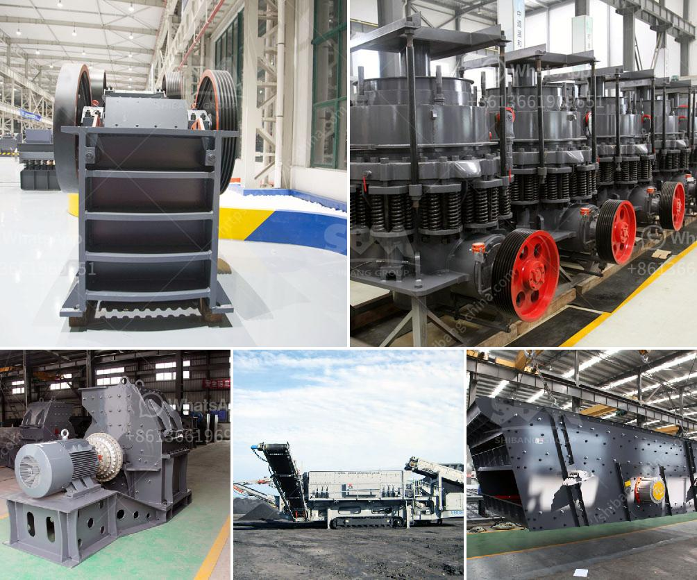

<h3>gypsum board manufacturing machine</h3>
Gypsum board, commonly known as drywall or plasterboard, is an essential building material used for constructing interior walls and ceilings. It is widely used in residential and commercial buildings due to its versatility, durability, and fire-resistant properties. The manufacturing process of gypsum board has come a long way with the advent of innovative gypsum board manufacturing machines. These machines play a significant role in producing high-quality gypsum boards efficiently and cost-effectively.

One of the most crucial aspects of gypsum board production is the mixing of gypsum powder with water to form a slurry. Traditional methods involved manual mixing, which was time-consuming and labor-intensive. However, with the introduction of gypsum board manufacturing machines, this process has been fully automated. The machine precisely controls the mixture, ensuring consistent quality and reduction in wastage. This not only saves time but also improves the overall efficiency of the manufacturing process.

The next step in gypsum board manufacturing is the shaping and drying of the slurry. Previously, this step required skilled workers to manually shape the slurry into desired board dimensions and then dry them in the sun or using artificial heating methods. However, the introduction of gypsum board manufacturing machines has completely transformed this process. These machines can shape the slurry into precise board dimensions using high-speed rollers. Furthermore, they utilize advanced drying techniques such as hot air circulation, infrared technology, or microwave drying, resulting in faster and more efficient drying of the boards.

One of the significant advantages of modern gypsum board manufacturing machines is their ability to produce different types of gypsum boards. These machines can adjust various parameters, such as board thickness, length, and width, to meet different construction requirements. Additionally, they can produce specialty gypsum boards, including water-resistant, fire-resistant, or soundproof boards, which have become increasingly popular in modern construction projects.

Gypsum board manufacturing machines also contribute to environmental sustainability. These machines are equipped with high-efficiency waste collection systems, which significantly reduce the amount of waste generated during the manufacturing process. Moreover, they optimize the usage of resources such as water and energy, reducing the ecological footprint of gypsum board production.

The benefits of gypsum board manufacturing machines extend beyond the production process. Their automation and efficiency lead to cost savings, making gypsum boards more affordable and accessible. This, in turn, has a positive impact on the construction industry, as more projects can utilize gypsum boards as a reliable and cost-effective building material.

In conclusion, gypsum board manufacturing machines have revolutionized the construction industry by streamlining the production process and improving the quality and consistency of gypsum boards. These machines have automated various tasks, reduced wastage, increased productivity, and expanded the range of gypsum boards produced. Additionally, they contribute to environmental sustainability and cost savings. As the demand for gypsum boards continues to grow, the role of gypsum board manufacturing machines becomes increasingly essential in meeting the construction industry's needs efficiently and effectively.
<h3>Contact us</h3><ul><li><strong>Whatsapp:&nbsp;<a href="https://wa.me/8613661969651">+8613661969651</a></strong></li><li><a href="https://swt.shibang-china.com/?git&amp;zhl&amp;gypsum board manufacturing machine"><strong>Online Service(chat now)</strong></a></li></ul><h3>Related</h3><ul><li><a href='how to build a concrete crusher.md'>how to build a concrete crusher</a></li><li><a href='ballast ore crusher for sale in kenya.md'>ballast ore crusher for sale in kenya</a></li><li><a href='china gold water grinding mills.md'>china gold water grinding mills</a></li><li><a href='kenya jaw crusher for sale.md'>kenya jaw crusher for sale</a></li><li><a href='mobile aggregates washing plant.md'>mobile aggregates washing plant</a></li></ul>