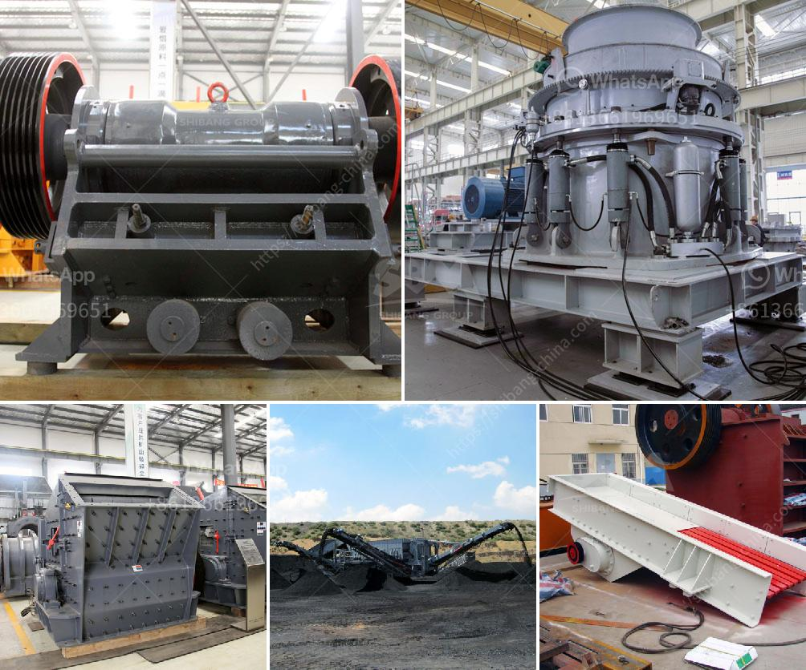

<h3>gypsum board plant in richmond hill</h3>
The gypsum board plant located in Richmond Hill is a critical asset to the local community and the construction industry as a whole. This manufacturing facility plays a vital role in producing gypsum boards, also known as drywall or plasterboard, which are widely used in residential and commercial construction projects.

Gypsum boards are highly versatile building materials that provide numerous benefits. They are lightweight, easy to install, and cost-effective, making them a preferred choice for interior walls and ceilings. Moreover, they have excellent fire resistance properties, enhancing the safety of buildings. Gypsum boards also contribute to sound insulation and can help improve energy efficiency in buildings.

The Richmond Hill gypsum board plant is equipped with state-of-the-art machinery and technology, ensuring the production of high-quality gypsum boards. The facility utilizes a rigorous production process that begins with extracting gypsum, a naturally occurring mineral, from nearby quarries. This gypsum is then finely ground and mixed with water, forming a slurry.

The slurry is poured into molds lined with paper facings and passed through a continuous production line. The mixture gradually solidifies as it moves along, and the excess water is evaporated. Once the boards reach the desired thickness, they are cut into various sizes, dried, and bundled for transportation.

The plant in Richmond Hill adheres to strict environmental regulations and promotes sustainable practices. Efforts are made to recycle as much waste as possible throughout the production process, reducing the plant's environmental footprint. Additionally, the facility utilizes energy-efficient equipment and constantly explores ways to minimize energy consumption.

The gypsum board plant in Richmond Hill provides significant employment opportunities to the local community. It directly employs skilled workers, including engineers, technicians, and production staff. The facility also indirectly supports various jobs in transportation, logistics, and other related industries. This creates a positive economic impact by bolstering the region's job market and contributing to overall economic stability.

Furthermore, the presence of the gypsum board plant in Richmond Hill contributes to the development and growth of the construction industry in the area. Construction companies and contractors rely on a reliable supply of high-quality gypsum boards, which are readily available from this local plant. The accessibility of these materials supports efficient construction processes, reduces transportation costs, and boosts the overall competitiveness of construction projects in the region.

In conclusion, the gypsum board plant in Richmond Hill is an essential asset that benefits both the local community and the construction industry. Its production of high-quality gypsum boards supports the creation of safe, durable, and aesthetically pleasing buildings. Furthermore, the plant generates employment opportunities and stimulates economic growth. Through its commitment to sustainability and adherence to regulations, the facility ensures that its operations are environmentally responsible. Overall, the gypsum board plant in Richmond Hill proves to be a valuable resource for the community and a pillar of the construction industry.
<h3>Contact us</h3><ul><li><strong>Whatsapp:&nbsp;<a href="https://wa.me/8613661969651">+8613661969651</a></strong></li><li><a href="https://swt.shibang-china.com/?git&amp;zhl&amp;gypsum board plant in richmond hill"><strong>Online Service(chat now)</strong></a></li></ul><h3>Related</h3><ul><li><a href='concrete mobile crusher for rent in usa.md'>concrete mobile crusher for rent in usa</a></li><li><a href='bauxite mining process.md'>bauxite mining process</a></li><li><a href='quarry stone supplier in dubai.md'>quarry stone supplier in dubai</a></li><li><a href='granite and basalt crushing line ton per day.md'>granite and basalt crushing line ton per day</a></li><li><a href='mobile crusher ghana.md'>mobile crusher ghana</a></li></ul>