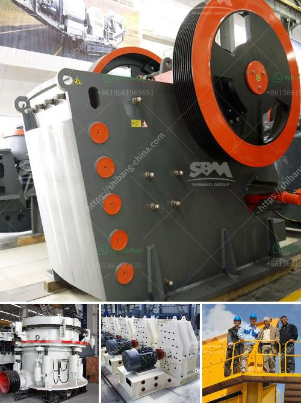

<h3>gypsum crusher manufacturing plant</h3>
Gypsum, a naturally occurring mineral, is widely used in various industries such as cement, construction, fertilizer production, and agriculture. It is mainly composed of calcium sulfate dihydrate (CaSO4·2H2O), which is a soft mineral also known as hydrated calcium sulfate. Gypsum is extracted from quarries or mines and then processed into a fine powder, which is called gypsum plaster or simply plaster.

To meet the growing demand for gypsum, manufacturing plants are essential. A gypsum crusher is an important machine in the gypsum crushing process. It breaks down the large gypsum ore into small particles and prepares them for further processing at a mining facility.

There are several types of crushers used in the gypsum crushing process. Jaw crusher is mainly used to crush the large gypsum ore into smaller sizes suitable for entering the grinding mill. Cone crusher and impact crusher are secondary crushing equipment commonly used in the mining industry. Gypsum powder grinding mill, also known as Raymond mill or vertical roller mill, is a common grinding equipment used in gypsum processing plants. It can be used to grind gypsum to a fineness of 200-300 mesh.

Gypsum crusher manufacturing plants are now more widely recognized for their energy-saving, environmental protection, high efficiency, and low consumption. Reliable equipment quality and professional technical support are essential for gypsum processing plants. In recent years, manufacturers have developed many new types of crushers with advanced technology, aiming to provide customers with more efficient and economical crushing equipment.

One of the key considerations when investing in a gypsum crusher manufacturing plant is the production capacity. Depending on the specific requirements of the customer, the production capacity of the plant can be customized. A small-scale plant can have a production capacity of 1-2 tons per hour, while a large-scale plant can exceed 100 tons per hour or more. The production capacity of the plant determines the efficiency of the gypsum crushing process and the overall output of the facility.

Another important factor to consider is the quality of the final product. Gypsum products are widely used in various industries, such as construction and agriculture. The quality of the final product directly affects its application and market value. Therefore, it is crucial to choose a gypsum crusher manufacturing plant with reliable performance and high-quality crushing equipment.

Additionally, the design and layout of the manufacturing plant should also be taken into account. The plant should be designed to have a smooth flow of materials, minimizing the risk of blockages or downtime. Adequate space for maintenance and repair should be allocated, ensuring the long-term operation of the plant.

In conclusion, gypsum crusher manufacturing plants are essential for the processing of gypsum. With the increasing demand for gypsum products in various industries, it is crucial to invest in a high-quality and efficient manufacturing plant. The choice of the plant should be based on factors such as production capacity, quality of the final product, and design layout. By investing in a reliable plant, manufacturers can ensure a smooth and efficient gypsum crushing process, ultimately contributing to their success in the industry.
<h3>Contact us</h3><ul><li><strong>Whatsapp:&nbsp;<a href="https://wa.me/8613661969651">+8613661969651</a></strong></li><li><a href="https://swt.shibang-china.com/?git&amp;zhl&amp;gypsum crusher manufacturing plant"><strong>Online Service(chat now)</strong></a></li></ul><h3>Related</h3><ul><li><a href='cone crusher in america.md'>cone crusher in america</a></li><li><a href='portable sand washing machine.md'>portable sand washing machine</a></li><li><a href='equipment required for the work of granite quarry.md'>equipment required for the work of granite quarry</a></li><li><a href='100tpd gold processing plant.md'>100tpd gold processing plant</a></li><li><a href='roll crushers for rent.md'>roll crushers for rent</a></li></ul>