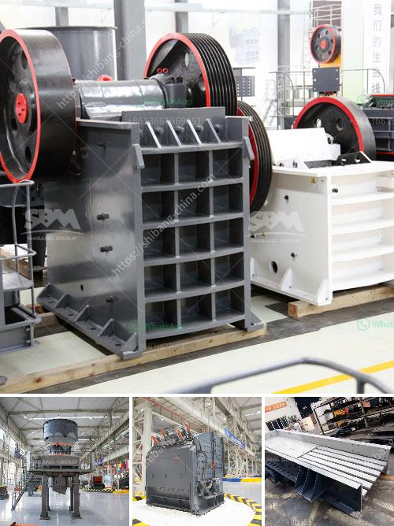

<h3>gypsum fertilizer granulator for sale</h3>
Gypsum has long been recognized as a beneficial soil amendment, providing a variety of benefits to plants and agricultural crops. One of the most effective ways to utilize gypsum as a soil conditioner is by using a gypsum fertilizer granulator. These machines are specifically designed to process raw gypsum into granular form, making it easier to apply to the soil.

The sale of gypsum fertilizer granulators has been on the rise in recent years, as more and more farmers and gardeners realize the advantages of using gypsum in their fields. The granulation process not only enhances the convenience of application but also improves the efficiency of gypsum utilization.

Gypsum contains calcium and sulfur, which are essential nutrients for plant growth. By granulating the gypsum, it becomes more readily available to plants, allowing for better nutrient uptake and utilization. This leads to healthier and more productive crops, as they have access to the necessary nutrients they need to thrive.

In addition to providing essential nutrients, gypsum also improves soil structure. It helps to break up heavy clay soils, making them more friable and easier to work with. This allows for better drainage and aeration, ensuring that plant roots have access to oxygen and water. Furthermore, gypsum counteracts the detrimental effects of salt buildup in the soil, promoting overall soil health.

A gypsum fertilizer granulator for sale is a cost-effective investment for farmers and gardeners looking to improve their soil fertility. The granules can be easily spread using conventional spreading equipment, reducing the time and labor required for application. Furthermore, the granules release their nutrients slowly over time, providing a sustained supply to the plants.

In conclusion, the use of gypsum fertilizer granulators has proven to be a game-changer in the agricultural industry. With the ability to transform raw gypsum into granular form, these machines have made it easier for farmers and gardeners to utilize gypsum in their fields. The benefits of using granulated gypsum as a soil amendment are numerous, including improved nutrient availability, enhanced soil structure, and overall soil health. If you are looking to improve your soil fertility and increase crop yields, consider investing in a gypsum fertilizer granulator for sale.
<h3>Contact us</h3><ul><li><strong>Whatsapp:&nbsp;<a href="https://wa.me/8613661969651">+8613661969651</a></strong></li><li><a href="https://swt.shibang-china.com/?git&amp;zhl&amp;gypsum fertilizer granulator for sale"><strong>Online Service(chat now)</strong></a></li></ul><h3>Related</h3><ul><li><a href='rock crusher used in mining and quarry for sale.md'>rock crusher used in mining and quarry for sale</a></li><li><a href='cone crushers to rent south africa.md'>cone crushers to rent south africa</a></li><li><a href='used crusher machines from china.md'>used crusher machines from china</a></li><li><a href='marble grinding machine bosch make.md'>marble grinding machine bosch make</a></li><li><a href='pakistan crusher machine complete.md'>pakistan crusher machine complete</a></li></ul>