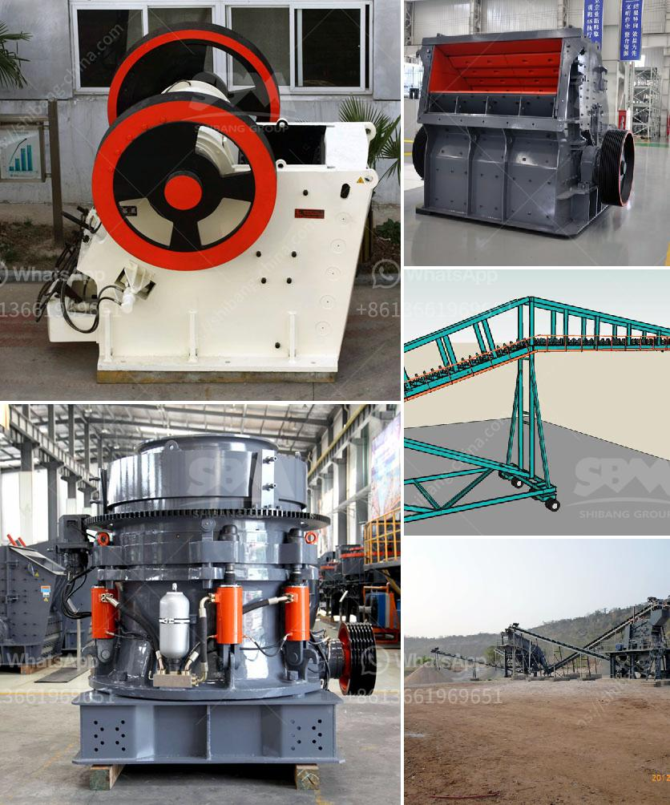

<h3>gypsum machine price</h3>
Gypsum machines play a vital role in the construction industry, as they are essential for producing gypsum products such as drywall, plasterboards, and ceiling tiles. These machines are designed to efficiently mix and grind gypsum rocks to turn them into a fine powder, which is then used in various applications. When considering purchasing or investing in gypsum machines, understanding the factors that influence their prices is crucial. In this article, we will explore the key aspects that affect gypsum machine prices.

One of the primary factors that determine the price of a gypsum machine is its quality and capacity. Higher-quality machines are usually made from durable materials, and equipped with advanced technologies, ensuring longer lifespan and improved performance. Additionally, machines with high capacity are capable of producing a larger quantity of gypsum products in a shorter time frame, making them more productive and valuable for commercial purposes. As a result, high-quality, high-capacity gypsum machines generally have a higher price tag compared to their lower-quality counterparts.

The brand of the gypsum machine also plays a significant role in determining its price. Well-established brands with a strong reputation in the industry are likely to offer higher prices for their machines. This is often due to their commitment to quality, customer service, and continuous innovation. While investing in a reputable brand may result in a higher upfront cost, it often provides long-term benefits in terms of durability, performance, and after-sales support.

The market demand for gypsum machines and the level of competition among manufacturers can influence their prices. If the demand for gypsum machines is high, manufacturers might increase their prices to maximize profits. On the other hand, intense competition within the market can lead to price reductions as manufacturers strive to attract more buyers. Understanding the dynamics of the market and comparing prices from different manufacturers can help buyers find the best deal.

Gypsum machines often come with additional features that enhance their functionality and user experience. For instance, some machines may have dust collection systems to minimize airborne particles during the grinding process, ensuring a safer working environment. Others might offer automation features, such as programmable controls or remote operation, to streamline the production process. Furthermore, customization options, such as the ability to adjust the size or shape of the final gypsum product, can also affect the machine's price.

Lastly, the price of a gypsum machine can be influenced by the location of the manufacturer and shipping costs. If the machine is produced in a country with lower manufacturing costs, it may result in a lower purchase price. However, buyers should also consider the additional expenses associated with shipping the machine to their desired destination. These costs can vary significantly depending on the distance, logistics, and any import taxes or duties applicable in the receiving country.

In conclusion, several key factors determine the price of gypsum machines. These include the quality and capacity of the machine, the brand reputation, the market demand and competition, the presence of additional features and customization options, and the location and shipping costs. By considering these factors and conducting thorough research, buyers can make informed decisions and find the gypsum machine that best suits their budget and requirements.
<h3>Contact us</h3><ul><li><strong>Whatsapp:&nbsp;<a href="https://wa.me/8613661969651">+8613661969651</a></strong></li><li><a href="https://swt.shibang-china.com/?git&amp;zhl&amp;gypsum machine price"><strong>Online Service(chat now)</strong></a></li></ul><h3>Related</h3><ul><li><a href='rock crusher screen.md'>rock crusher screen</a></li><li><a href='grinding machine for marble.md'>grinding machine for marble</a></li><li><a href='impact crusher machine manufacturer.md'>impact crusher machine manufacturer</a></li><li><a href='crusher hp300 cone.md'>crusher hp300 cone</a></li><li><a href='stone crushers made in china.md'>stone crushers made in china</a></li></ul>