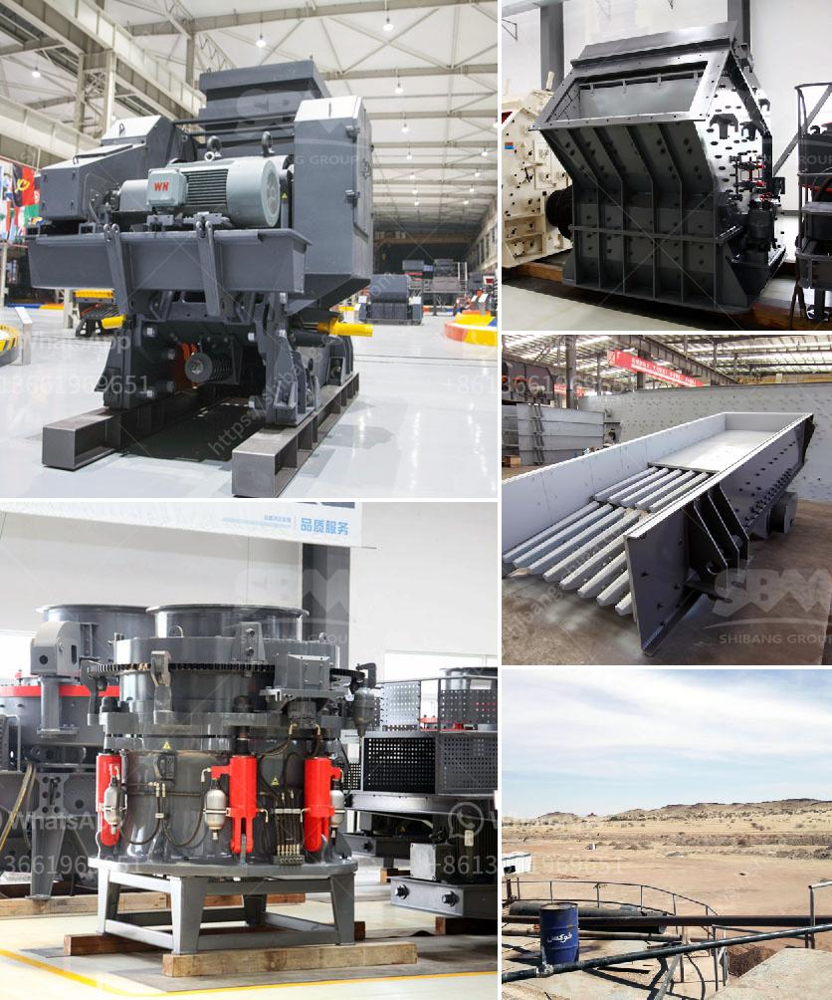

<h3>gypsum manufacturing process</h3>
Gypsum is a mineral that is commonly used in construction projects. It is a versatile material that can be shaped into various forms and is known for its fire-resistant and soundproofing properties. In this article, we will discuss the manufacturing process of gypsum.

The process starts with the extraction of gypsum ore from mines or quarries. These mines or quarries can be found in various countries around the world, including the United States, Canada, and Iran. The extracted ore is then transported to a processing plant where it undergoes several steps to become usable gypsum.

The first step in the manufacturing process is the crushing and grinding of raw materials. These materials include limestone, dolomite, and clay. The crushed and ground raw materials are then mixed with water to form a slurry. The slurry is then heated to a temperature of around 150 degrees Celsius in a calcination unit.

During the calcination process, the gypsum slurry is heated to remove the excess water content. This results in the formation of calcium sulfate hemihydrate, also known as stucco. The stucco is then transferred to a storage area where it is cooled and dried.

Once the stucco is dried, it is further processed to produce the final product. This process involves grinding the dried stucco into a fine powder, which is then used to manufacture gypsum products such as plaster, wallboards, and ceiling tiles.

The final step in the manufacturing process is the packaging and distribution of the gypsum products. The powdered gypsum is typically packed into bags or bulk containers and shipped to various construction sites or retailers.

In conclusion, the manufacturing process of gypsum involves several steps, including the extraction of raw materials, crushing and grinding, calcination, drying, grinding, and packaging. This process transforms the raw material into versatile gypsum products that are widely used in the construction industry for their strength, fire resistance, and soundproofing properties.
<h3>Contact us</h3><ul><li><strong>Whatsapp:&nbsp;<a href="https://wa.me/8613661969651">+8613661969651</a></strong></li><li><a href="https://swt.shibang-china.com/?git&amp;zhl&amp;gypsum manufacturing process"><strong>Online Service(chat now)</strong></a></li></ul><h3>Related</h3><ul><li><a href='alluvial chrome wash plant in zimbabwe.md'>alluvial chrome wash plant in zimbabwe</a></li><li><a href='quarry equipment for sale.md'>quarry equipment for sale</a></li><li><a href='crusher plant suppliers in saudi arabia.md'>crusher plant suppliers in saudi arabia</a></li><li><a href='hammer mill machine south africa.md'>hammer mill machine south africa</a></li><li><a href='cone crusher secondary price.md'>cone crusher secondary price</a></li></ul>