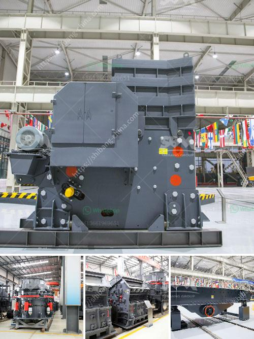

<h3>gypsum milling prices in kenya</h3>
Gypsum is a mineral that is commonly used in construction projects, especially as a raw material for wallboards and plaster. In Kenya, there are several gypsum mines that contribute significantly to the local economy. The milling process is the first step in gypsum production, and it involves grinding gypsum stones into a fine powder.

Gypsum milling prices in Kenya are usually based on the type of gypsum that is being produced. The most common types of gypsum available in the country include:

1. Natural gypsum: This is gypsum that is directly mined from the earth. It is in its raw form and requires further processing to be used in construction. Natural gypsum is usually more expensive compared to synthetic gypsum.

2. Synthetic gypsum: This type of gypsum is a byproduct of various industrial processes, such as flue gas desulfurization in power plants or chemical manufacturing. It is produced by converting the sulfur dioxide gases emitted during these processes into calcium sulfate, which is the main component of gypsum. Synthetic gypsum is less expensive compared to natural gypsum.

The milling prices for gypsum in Kenya can vary depending on factors such as the production volume, location of the mine, and the market demand. Larger mines generally have lower milling prices due to economies of scale and higher production volumes. Mines located in remote areas may have higher milling prices due to transportation costs.

Another factor that affects gypsum milling prices is the level of competition in the industry. In Kenya, gypsum milling is mainly carried out by a few major companies, and the prices they set can have a significant impact on the overall market. When there is high competition, companies may reduce their milling prices to attract more customers. Conversely, when there is limited competition, companies may increase their prices to maximize their profits.

Additionally, international factors such as the global supply and demand for gypsum can also influence milling prices in Kenya. For example, if there is a shortage of gypsum in the global market, the prices may increase. Conversely, if there is an oversupply of gypsum, the prices may decrease. The global prices of gypsum are typically influenced by factors such as construction activity, economic growth, and the demand for building materials.

In conclusion, gypsum milling prices in Kenya can vary depending on factors such as the type of gypsum, production volume, location of the mine, market demand, competition, and international factors. It is important for stakeholders in the construction industry, including contractors, builders, and developers, to monitor these factors to make informed decisions regarding gypsum procurement. Additionally, government intervention and policies can play a crucial role in stabilizing gypsum milling prices and ensuring a sustainable supply of this essential construction material.
<h3>Contact us</h3><ul><li><strong>Whatsapp:&nbsp;<a href="https://wa.me/8613661969651">+8613661969651</a></strong></li><li><a href="https://swt.shibang-china.com/?git&amp;zhl&amp;gypsum milling prices in kenya"><strong>Online Service(chat now)</strong></a></li></ul><h3>Related</h3><ul><li><a href='gold crushers sale.md'>gold crushers sale</a></li><li><a href='mining process of marble crusher.md'>mining process of marble crusher</a></li><li><a href='mobile cone crusher.md'>mobile cone crusher</a></li><li><a href='different types of roller milling.md'>different types of roller milling</a></li><li><a href='gypsum plant unit and utilities.md'>gypsum plant unit and utilities</a></li></ul>