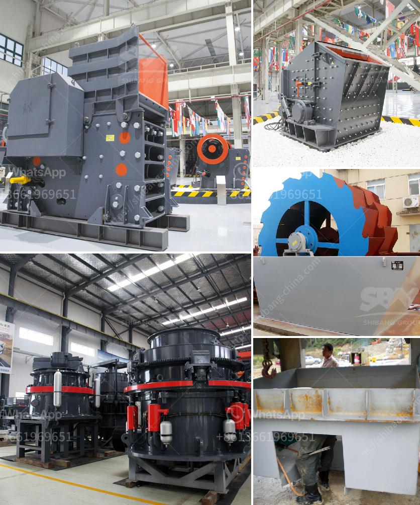

<h3>gypsum plant unit and utilities</h3>
The gypsum plant unit is a crucial component of any construction project. It is responsible for producing gypsum powder, which is widely used in the construction industry for various applications such as molding and drywall. The unit typically consists of a gypsum crusher, a grinding mill, a calcination unit, and storage facilities.

The gypsum crusher is the first step in the process, breaking the large-sized gypsum ore into smaller pieces that can be easily handled and transported. The crushed gypsum is then conveyed to the grinding mill, where it is ground into a fine powder. The grinding process ensures that the gypsum particles are of uniform size, which is essential for achieving the desired quality and consistency of the final product.

After the grinding process, the gypsum powder is sent to the calcination unit, where it is heated at high temperatures to remove the excess water content. This process converts the raw gypsum into a hemihydrate form known as plaster of Paris, which has excellent properties for construction purposes. The drying and calcination process is carefully controlled to optimize the product quality and minimize energy consumption.

Utilities play a crucial role in the operation of the gypsum plant unit. They include water, electricity, and fuel supplies. Water is essential for various stages of the process, such as grinding and calcination, as well as for maintaining the dust control system. Electricity powers the entire unit, driving the crusher, mill, and other equipment. Fuel, typically natural gas or coal, is used for heating in the calcination unit.

Efficient management of utilities is essential to minimize production costs and ensure continuous operation. Modern gypsum plant units often incorporate energy-efficient technologies and process optimizations to reduce resource consumption and environmental impact.

In conclusion, the gypsum plant unit and its utilities are essential components in the production of gypsum powder for the construction industry. The unit comprises a crusher, grinding mill, calcination unit, and storage facilities. Utilities, including water, electricity, and fuel, are vital for the plant's operation. Efficient management of these utilities is crucial for cost optimization and environmental sustainability.
<h3>Contact us</h3><ul><li><strong>Whatsapp:&nbsp;<a href="https://wa.me/8613661969651">+8613661969651</a></strong></li><li><a href="https://swt.shibang-china.com/?git&amp;zhl&amp;gypsum plant unit and utilities"><strong>Online Service(chat now)</strong></a></li></ul><h3>Related</h3><ul><li><a href='business proposal sample for gold milling.md'>business proposal sample for gold milling</a></li><li><a href='calcium carbonate manufacturing plant.md'>calcium carbonate manufacturing plant</a></li><li><a href='hammer mill price south africa.md'>hammer mill price south africa</a></li><li><a href='limestone rock crusher.md'>limestone rock +crusher</a></li><li><a href='mining crusher plants in egypt.md'>mining crusher plants in egypt</a></li></ul>