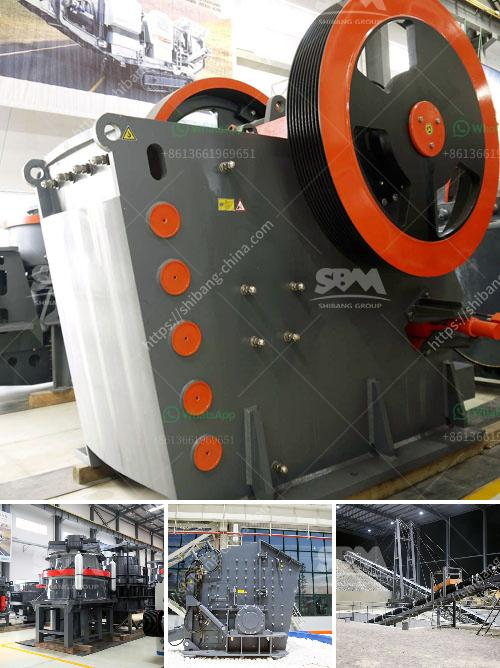

<h3>gypsum powder line</h3>
Gypsum is a widely used mineral that has a wide range of applications in various industries. One of its most common uses is in the construction industry, where it is used to produce gypsum powder. Gypsum powder lines are production lines that utilize gypsum as a raw material to produce gypsum powder, which is widely used in the construction industry as a binder and filler material.

Gypsum powder lines are essentially a series of machines that grind, dry, and calcine gypsum rock into a fine powder. The process starts by extracting gypsum rock from mines or quarries. The rock is then crushed into smaller pieces and heated to remove any moisture content. The dried gypsum rock is then ground into a fine powder using specialized mills. The ground gypsum powder is then heated at a high temperature in a calcining system to convert it into a hemi-hydrate form, which is the desired end product.

There are several key components involved in a gypsum powder line. These include crushers, grinding mills, calciners, dust collectors, and conveyors. Crushers are used to crush the raw gypsum rock into smaller pieces. Grinding mills then grind the crushed gypsum rock into a fine powder. Calciners heat the ground gypsum powder to remove any remaining moisture and convert it into a hemi-hydrate form. Dust collectors are used to collect any dust generated during the grinding and calcining processes, ensuring a clean and safe working environment. Conveyors are used to transport the gypsum powder from one machine to another, facilitating the smooth and continuous operation of the production line.

Gypsum powder lines are designed to be highly efficient and productive. The production capacity of a gypsum powder line can range from a few tons per hour to several hundred tons per hour, depending on the specific requirements of the customer. Advanced control systems are often integrated into these production lines to ensure optimal performance and maximize production output.

Gypsum powder produced from gypsum powder lines has a wide range of applications in the construction industry. It is commonly used as a binder in the production of plasterboard, which is widely used for walls and ceilings in residential and commercial buildings. Gypsum powder is also used as a filler material in various cement-based products, such as joint compounds, tile adhesives, and self-leveling underlayments. Additionally, gypsum powder can be used as a soil amendment for agricultural purposes to improve soil structure and fertility.

In conclusion, gypsum powder lines play a crucial role in the production of gypsum powder, which is widely used in the construction industry. These production lines consist of various machines and components that work together to grind, dry, and calcine gypsum rock into a fine powder. The gypsum powder produced from these lines has numerous applications and is essential for the construction of modern buildings. With their high efficiency and productivity, gypsum powder lines are vital in meeting the growing demand for gypsum powder in the construction industry.
<h3>Contact us</h3><ul><li><strong>Whatsapp:&nbsp;<a href="https://wa.me/8613661969651">+8613661969651</a></strong></li><li><a href="https://swt.shibang-china.com/?git&amp;zhl&amp;gypsum powder line"><strong>Online Service(chat now)</strong></a></li></ul><h3>Related</h3><ul><li><a href='clay crusher manufacture process.md'>clay crusher manufacture process</a></li><li><a href='manufacturing of talcum powder.md'>manufacturing of talcum powder</a></li><li><a href='roller mill compontes.md'>roller mill compontes</a></li><li><a href='cone crusher zenith.md'>cone crusher zenith</a></li><li><a href='stone crusher machine usato in italy.md'>stone crusher machine usato in italy</a></li></ul>