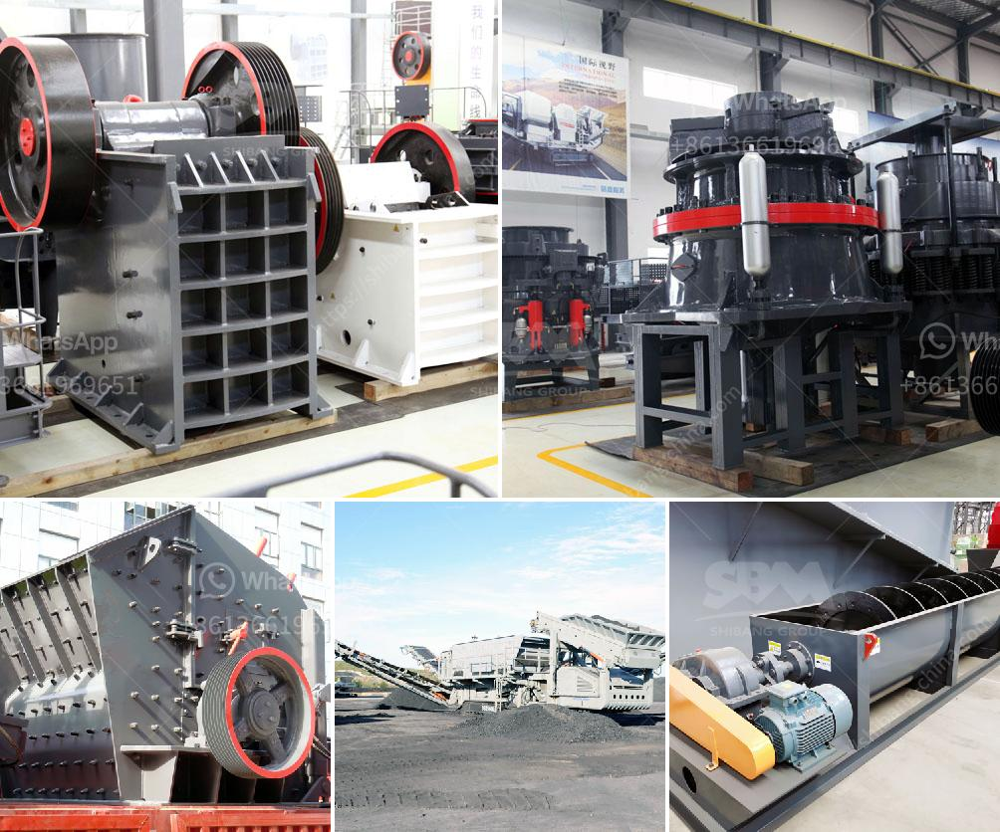

<h3>gypsum powder machine for sale</h3>
Gypsum powder is a versatile material widely used in various industries. Whether it's construction, agriculture, or even medical, gypsum powder has proven to be an essential component. To extract gypsum in its purest form, a gypsum powder machine is required. These machines are designed to crush and grind the raw gypsum into a powder, ensuring a consistent and high-quality product.

If you are in search of a gypsum powder machine for sale, you have come to the right place. There are numerous options available in the market, catering to different production capacities and budgets. When choosing a gypsum powder machine, it is essential to consider factors such as the equipment's efficiency, durability, and overall performance.

One key feature to look for in a gypsum powder machine is its ability to engage in high-speed production without compromising on the quality of the final product. This ensures that you can meet your production targets without compromising on the purity and fineness of the gypsum powder.

Furthermore, a reliable gypsum powder machine should be designed for ease of operation and maintenance. Look for machines that offer user-friendly interfaces, allowing operators to control and monitor the production process effortlessly. Additionally, easy access to key components, such as grinding mills and dust collectors, ensures that maintenance and repairs can be conducted quickly and smoothly, minimizing downtime and maximizing productivity.

Price is another crucial factor to consider when searching for a gypsum powder machine for sale. While it is important to stick to your budget, do not compromise on the quality and reliability of the machine. Remember, investing in a high-quality gypsum powder machine will result in long-term cost savings due to lower maintenance costs and higher production efficiency.

In conclusion, a gypsum powder machine for sale is an essential investment for businesses in various industries. By choosing the right machine with the necessary features and capabilities, you can ensure consistent, high-quality gypsum powder production. So, take your time, do thorough market research, and select a reliable machine that meets your production requirements and budget.
<h3>Contact us</h3><ul><li><strong>Whatsapp:&nbsp;<a href="https://wa.me/8613661969651">+8613661969651</a></strong></li><li><a href="https://swt.shibang-china.com/?git&amp;zhl&amp;gypsum powder machine for sale"><strong>Online Service(chat now)</strong></a></li></ul><h3>Related</h3><ul><li><a href='india stone crusher machine.md'>india stone crusher machine</a></li><li><a href='working of hydraulic circuit for milling machine.md'>working of hydraulic circuit for milling machine</a></li><li><a href='hydraulic css control for jaw crusher.md'>hydraulic css control for jaw crusher</a></li><li><a href='wet wet grinding mills.md'>wet wet grinding mills</a></li><li><a href='price of stone crusher size.md'>price of stone crusher size</a></li></ul>