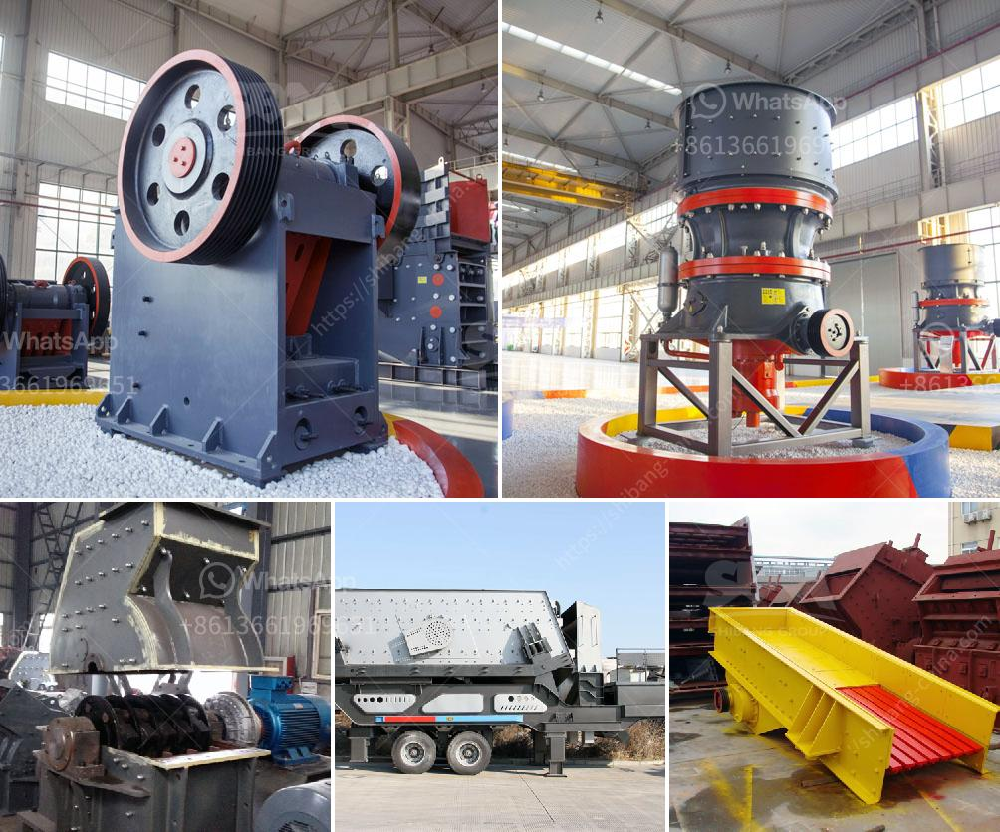

<h3>gypsum powder processing plant india</h3>
India has immense potential for the processing of gypsum powder, which is widely used in construction, agriculture, and various other industries. Gypsum powder processing plant India is witnessing a surge in demand for gypsum powder for numerous reasons, given that its applications are endless. This mineral possesses several properties that make it incredibly useful in various sectors.

Gypsum is a mineral that consists of a hydrated calcium sulfate compound. It is commonly found in sedimentary rocks and is known for its white and transparent appearance. The mineral has been used for centuries in different forms, and gypsum powder is one of its most versatile derivatives.

One of the primary applications of gypsum powder is in the construction industry. It is used to make gypsum boards, which are extensively utilized for interior walls and ceilings. Gypsum boards offer excellent fire resistance, sound insulation, and thermal properties, making them a preferred choice among builders and architects. With the construction industry booming in India, the demand for gypsum powder is skyrocketing.

Agriculture is another sector where gypsum powder finds significant use. It is used as a soil amendment to improve soil structure and fertility. Gypsum powder helps in breaking compacted soil, allowing better water infiltration and root growth. It also provides essential nutrients like calcium and sulfur to the plants. Farmers in India are increasingly recognizing the benefits of using gypsum powder, resulting in higher demand.

Besides construction and agriculture, gypsum powder has several other industrial applications. It is used in the manufacturing of cement, as an additive to control the setting time. It is also used as a filler in paper, paints, and textiles. The pharmaceutical industry uses gypsum powder in various medicinal preparations, such as antacids and topical creams. The versatility of gypsum powder makes it an indispensable mineral for countless industries.

To meet the growing demand for gypsum powder, many gypsum powder processing plants have been set up in India. These plants process gypsum and convert it into various forms, such as gypsum powder, gypsum particles, and gypsum boards. India has a vast reserve of natural gypsum, which makes it easier for processing plants to source the mineral. However, synthetic gypsum is also used, which is obtained as a byproduct from various industries.

The gypsum powder processing plants in India utilize advanced technologies to improve the overall process efficiency and minimize energy consumption. The plants also adopt proper waste management techniques to ensure environmentally sustainable operations. The use of automated machinery and equipment ensures high precision and quality consistency in the processed gypsum powder.

The gypsum powder processing plant India market is growing significantly with the rising construction activities across the country. The government's focus on infrastructure development and affordable housing schemes further fuels the demand for gypsum powder. Additionally, the agricultural sector's increasing adoption of gypsum powder boosts its production.

In conclusion, the gypsum powder processing plant India market is experiencing rapid growth due to the wide range of applications for gypsum powder across various industries. The demand for gypsum powder in construction, agriculture, and other sectors is driving the establishment of processing plants across the country. With its abundant reserves of natural gypsum, India has a competitive advantage in the global market. The gypsum powder processing industry in India is poised for continued expansion and success.
<h3>Contact us</h3><ul><li><strong>Whatsapp:&nbsp;<a href="https://wa.me/8613661969651">+8613661969651</a></strong></li><li><a href="https://swt.shibang-china.com/?git&amp;zhl&amp;gypsum powder processing plant india"><strong>Online Service(chat now)</strong></a></li></ul><h3>Related</h3><ul><li><a href='stone crusher plant minimum capacity price in india.md'>stone crusher plant minimum capacity price in india</a></li><li><a href='roll crushers for rent.md'>roll crushers for rent</a></li><li><a href='high reversible mill with 750 mm diameter rolls.md'>high reversible mill with 750 mm diameter rolls</a></li><li><a href='chrome crusher machine price list.md'>chrome crusher machine price list</a></li><li><a href='hammer milling disadvantages.md'>hammer milling disadvantages</a></li></ul>