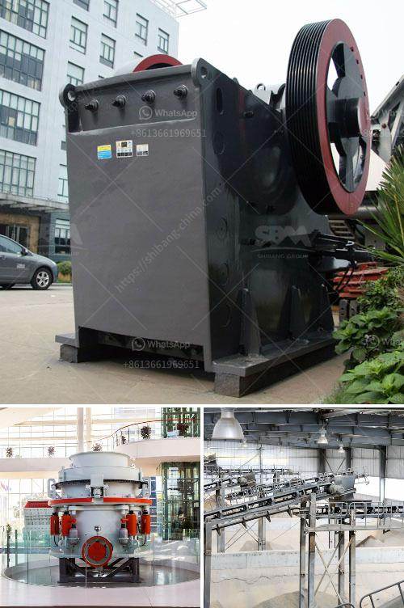

<h3>gypsum powder production line germany</h3>
Gypsum powder production line in Germany stands out from others for its precise and secure production process. Gypsum powder comes from natural gypsum ore, a mineral rock formed by the evaporation of ancient sea water. The gypsum powder production line in Germany mainly consists of jaw crusher, ultrafine mill, bucket elevator, electromagnetic vibrating feeder, classifier, dust collector and other related equipment.

The main component of gypsum powder is calcium sulfate hydrate, which is a highly versatile material used in various industries. As a professional manufacturer of mining equipment, SBM provides high-performance gypsum powder production line in Germany. Our advanced technology and complete service system allow us to become a competent and reliable supplier. Our gypsum powder production line has the following advantages and features.

Firstly, the production efficiency is high. Our gypsum powder production line is equipped with the latest technology, which reflects in the high production efficiency. The German gypsum powder production line adopts a closed-circuit crushing system with a vibrating screen to prevent over-sized materials from entering the ultrafine mill. This not only saves energy but also achieves the finished product size requirements.

Secondly, the product quality is reliable. Our gypsum powder production line is designed with high quality components. The ultrafine mill is installed with a frequency converter, which achieves exquisite control of the grinding process. The finished product has a uniform particle size and good stability.

Thirdly, the operation is simple and convenient. The gypsum powder production line in Germany is easy to operate and maintain. The gypsum powder machine adopts a sealed gear box and pulley drive system, which ensures the smooth operation of the whole production process.

Finally, the environmental protection effect is remarkable. The German gypsum powder production line uses a pulse bag filter to capture dust generated during the production process, effectively reducing dust pollution.

In conclusion, the gypsum powder production line in Germany is a cost-effective solution for gypsum powder manufacturers worldwide. It has outstanding advantages in terms of quality, efficiency, operation, and environmental protection. As a professional manufacturer of mining equipment, SBM has more than 30 years of experience in the development and production of crushers, mills, and other mining equipment. We are committed to providing customers with high-quality and efficient equipment and services. If you are interested in our gypsum powder production line in Germany, please feel free to contact us for more information.
<h3>Contact us</h3><ul><li><strong>Whatsapp:&nbsp;<a href="https://wa.me/8613661969651">+8613661969651</a></strong></li><li><a href="https://swt.shibang-china.com/?git&amp;zhl&amp;gypsum powder production line germany"><strong>Online Service(chat now)</strong></a></li></ul><h3>Related</h3><ul><li><a href='rencana bisnis perusahaan tambang pdf.md'>rencana bisnis perusahaan tambang pdf</a></li><li><a href='stone crusher plants.md'>stone crusher plants</a></li><li><a href='different types of vibrating screen.md'>different types of vibrating screen</a></li><li><a href='manufacturing of talcum powder.md'>manufacturing of talcum powder</a></li><li><a href='cost of setting up quarry plant in nigeria.md'>cost of setting up quarry plant in nigeria</a></li></ul>