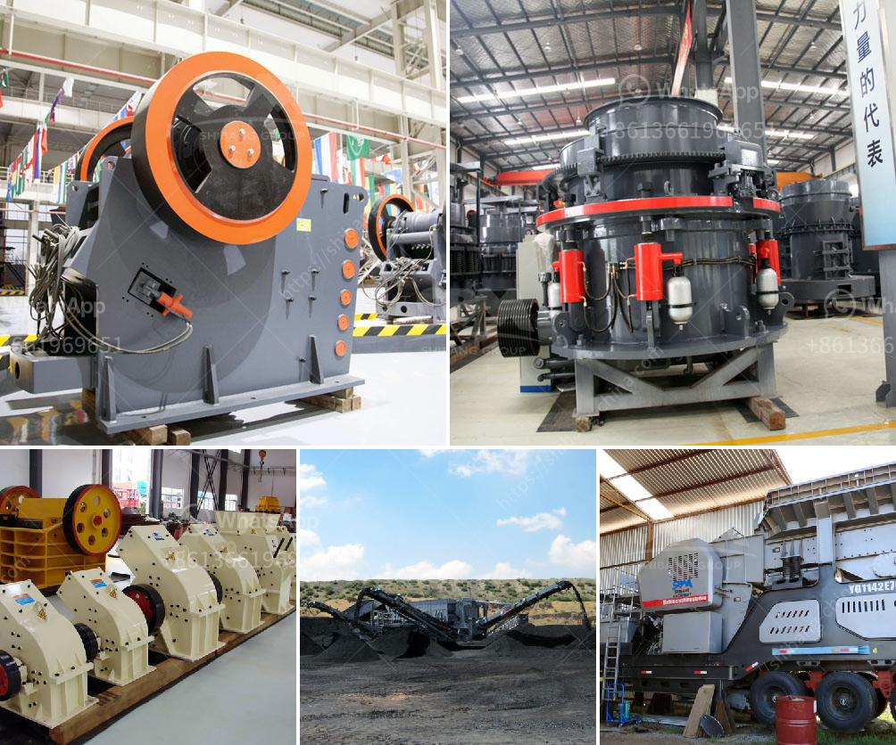

<h3>gypsum powder production process</h3>
Gypsum powder has been widely used in many industries for a long time. With the technology progress and continuous innovation, gypsum powder production process has been greatly improved.

Gypsum is a widely used industrial material and building material. Gypsum powder plays an important role in various industries, such as agriculture, construction, and chemical and food industries. It is used as an important industrial raw material, which is an indispensable product in our daily life.

Gypsum powder is processed by a gypsum powder production line. In the production line, gypsum is crushed and heated to remove water molecules. Then it is ground into a powder with the required fineness. The gypsum powder is classified and dried by a classifier and a dryer.

Gypsum powder production processes mainly include gypsum crushing, gypsum grinding, and gypsum calcination.

Gypsum crushing is the first stage in gypsum powder production line, which is processed by the jaw crusher and impact crusher. The gypsum particles are fed into the crusher by the vibrating feeder, and crushed into small particles less than 30mm. Then they are transported to the mill for grinding.

Gypsum grinding is the second stage in gypsum powder production line. In this process, gypsum is crushed by the Raymond mill (or ball mill) into powder with the required fineness. Then the powder is sent to a gypsum calciner, where it is heated to remove excess water molecules and convert gypsum into its hemihydrate form (CaSO4·0.5H2O).

Gypsum calcination is the final stage in gypsum powder production line. To successfully complete the calcination process, raw gypsum is heated in a rotary kiln at a high temperature, reducing it to its final hemihydrate form. The calcined gypsum, also known as plaster of Paris, is then ground to a fine powder and is ready for use.

The gypsum powder production process is not only simple and reliable, but also economical and environmentally friendly. It effectively utilizes the waste heat generated by the gypsum calcination process, reducing energy consumption and environmental pollution. Moreover, the produced gypsum powder has a wide range of applications and excellent performance, making it an ideal choice for various industries.

In conclusion, gypsum powder production process has been greatly improved with the continuous development of technology. It not only provides a reliable and efficient production method for gypsum powder but also brings economic benefits and environmental protection. As a widely used industrial material, gypsum powder plays an irreplaceable role in various industries.
<h3>Contact us</h3><ul><li><strong>Whatsapp:&nbsp;<a href="https://wa.me/8613661969651">+8613661969651</a></strong></li><li><a href="https://swt.shibang-china.com/?git&amp;zhl&amp;gypsum powder production process"><strong>Online Service(chat now)</strong></a></li></ul><h3>Related</h3><ul><li><a href='kaolin mining india.md'>kaolin mining india</a></li><li><a href='mtw european type trapezium mill.md'>mtw european type trapezium mill</a></li><li><a href='coal washing process yotube.md'>coal washing process yotube</a></li><li><a href='spare parts for a jaw crusher.md'>spare parts for a jaw crusher</a></li><li><a href='mobile crushing and screening manufacturer in india.md'>mobile crushing and screening manufacturer in india</a></li></ul>