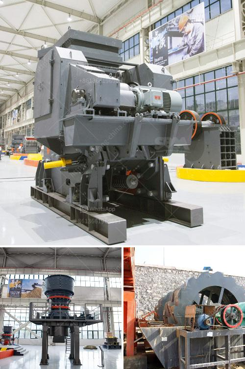

<h3>gypsum production in visakhapatnam</h3>
Gypsum is a mineral widely used in construction materials such as plaster, cement, and drywall. Its production plays a crucial role in the development of infrastructure and urbanization. This article focuses on the gypsum production in Visakhapatnam, a rapidly growing industrial city located in Andhra Pradesh, India.

Visakhapatnam, also known as Vizag, is renowned for its rich reserves of mineral resources. With a strategic coastline and a well-connected network of roads, railways, and ports, the city has become a major hub for various industries, including mining and manufacturing. Its proximity to the Bay of Bengal facilitates the import and export of raw materials and finished products.

Gypsum production in Visakhapatnam is primarily carried out by the Visakhapatnam Mineral Development Corporation (VMDC), a state-owned enterprise established in 1981. The corporation operates gypsum mines in the Bheemunipatnam region, situated about 30 kilometers from the city. These mines have abundant deposits of high-quality gypsum, making Visakhapatnam one of the significant gypsum producing regions in India.

The extraction of gypsum from the mines involves a series of processes. Initially, the overburden, or the topsoil layer, is removed to expose the mineral-rich layers underneath. The gypsum ore is then extracted using various methods, including open-pit mining and underground mining. Open-pit mining is generally preferred as it allows for more significant production and easier access to the gypsum deposits.

Once the gypsum ore is extracted, it is transported to nearby processing plants for further refinement. The ore is crushed and heated to remove excess moisture, leading to the formation of a fine powder called gypsum plaster or stucco. This powder is then used to manufacture various construction materials.

One of the primary applications of gypsum is in the production of plasterboard, commonly known as drywall. Drywall is a prefabricated panel made of gypsum plaster sandwiched between two layers of paper. It is widely used in the construction industry for wall and ceiling installations. The demand for drywall has been growing rapidly in recent years due to the booming construction sector in Visakhapatnam and the surrounding areas.

Gypsum is also used as a component in cement production. It acts as a retarder, slowing down the chemical reaction between water and cement, which helps in achieving the desired setting and hardening time. Its use in cement production enhances the strength and durability of concrete structures.

The gypsum production in Visakhapatnam has contributed significantly to the economic growth of the region. It has generated employment opportunities for a large number of people, directly and indirectly. The revenue generated from gypsum mining has also contributed to the overall development of infrastructure and social welfare in Visakhapatnam.

However, it is crucial to ensure the sustainable extraction and utilization of gypsum resources. The mining and processing of gypsum should be carried out responsibly, taking into consideration the environmental impact and the welfare of the local communities. Measures such as reforestation, proper waste management, and adherence to safety regulations should be implemented to minimize any negative consequences.

In conclusion, gypsum production in Visakhapatnam has emerged as a significant sector within the city's mining and manufacturing industry. The availability of high-quality gypsum deposits and well-established infrastructure has facilitated its growth. As the demand for construction materials continues to rise, gypsum production is expected to play a crucial role in further boosting the economic development of Visakhapatnam.
<h3>Contact us</h3><ul><li><strong>Whatsapp:&nbsp;<a href="https://wa.me/8613661969651">+8613661969651</a></strong></li><li><a href="https://swt.shibang-china.com/?git&amp;zhl&amp;gypsum production in visakhapatnam"><strong>Online Service(chat now)</strong></a></li></ul><h3>Related</h3><ul><li><a href='recycled crushed concrete 20mm.md'>recycled crushed concrete 20mm</a></li><li><a href='malaysia conveyor belts.md'>malaysia conveyor belts</a></li><li><a href='conveyor belt suppliers in lusaka.md'>conveyor belt suppliers in lusaka</a></li><li><a href='crushers of cone ethiopia.md'>crushers of cone ethiopia</a></li><li><a href='gold mobile crushing equipment.md'>gold mobile crushing equipment</a></li></ul>