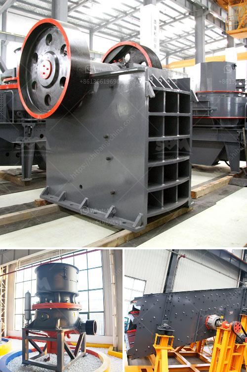

<h3>gypsum production line for making</h3>
Gypsum is a mineral widely used in construction, agriculture, and other industries. Its versatility makes it an essential material in various applications, such as producing plaster, drywall, cement, and even fertilizer. To meet the growing demand for gypsum and its by-products, manufacturers rely on efficient gypsum production lines.

A gypsum production line is an assembly of machines that produce gypsum products to suit various applications. It can comprise different types of equipment, depending on the product being manufactured. However, the basic setup usually includes a crusher, a grinding mill, a calcination kettle, and a packaging machine.

The first step in the gypsum production line is crushing the raw materials. Gypsum ore is usually quarried or mined, depending on its location. After extraction, it is crushed into smaller pieces using heavy-duty crushers. The crushed gypsum is then further reduced to a fine powder in a grinding mill. This powdery form is easier to handle and transport in subsequent processes.

After grinding, the gypsum powder is sent to a calcination kettle for the process of calcination. Calcination is a crucial step in the gypsum production line as it ensures the conversion of raw gypsum into its usable form. In the kettle, the gypsum powder is heated at high temperatures (around 150-165°C), causing it to release water molecules and transform into calcium sulfate hemihydrate (bassanite).

The calcined gypsum is then cooled and conveyed to a packaging machine. Depending on the specific requirements of customers, the gypsum products can be packaged in various forms, such as bulk bags, sacks, or even small containers. The packaging process ensures that the final products are protected, ready for transport, and easily handled at the construction site or manufacturing plant.

One of the main advantages of a well-designed gypsum production line is its overall efficiency. Each step in the process is carefully planned to minimize waste, reduce energy consumption, and optimize productivity. Additionally, modern gypsum production lines often incorporate advanced technologies, such as automation and control systems, to enhance operational efficiency and product quality.

Another notable aspect of gypsum production lines is the importance placed on environmental sustainability. Gypsum is a naturally occurring mineral, but its extraction and processing can have environmental impacts. To mitigate these, manufacturers implement eco-friendly practices throughout the production process. This includes efficient water and energy management, minimizing waste generation, and adopting proper chemical handling and disposal measures.

In conclusion, gypsum production lines are vital for meeting the growing demand for gypsum products. These production lines comprise various machines that efficiently process raw gypsum into usable forms, such as plaster, drywall, and cement. The carefully planned processes, coupled with advanced technologies, ensure high productivity, product quality, and sustainability. As the construction and agriculture industries continue to expand, the demand for gypsum and its by-products will only increase, making these production lines indispensable for manufacturers in the years to come.
<h3>Contact us</h3><ul><li><strong>Whatsapp:&nbsp;<a href="https://wa.me/8613661969651">+8613661969651</a></strong></li><li><a href="https://swt.shibang-china.com/?git&amp;zhl&amp;gypsum production line for making"><strong>Online Service(chat now)</strong></a></li></ul><h3>Related</h3><ul><li><a href='two roll mill roller price.md'>two roll mill roller price</a></li><li><a href='hammer mill technical.md'>hammer mill technical</a></li><li><a href='jaw crusher type sp 100 x.md'>jaw crusher type sp 100 x</a></li><li><a href='beneficiation small scale tin ore processing plant.md'>beneficiation small scale tin ore processing plant</a></li><li><a href='stone crusher plant minimum capacity price in india.md'>stone crusher plant minimum capacity price in india</a></li></ul>