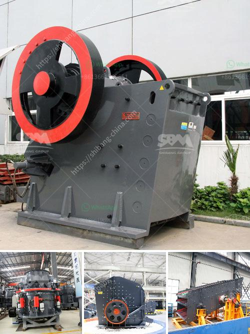

<h3>hammer crusher china</h3>
The hammer crusher China is a perfect combination of modern technology and production practice, which is more in line with the majority of customers' requirements about automation production. Moreover, it is widely used in industries such as metallurgy, mining, chemical engineering, cement and building materials, allowing them to crush hard or soft materials.

The hammer crusher China is particularly suitable for crushing medium hardness materials such as limestone, slag, coke, coal, etc. in cement, chemical, electric power, metallurgy and other industrial sectors. During the operation of the machine, the rotor rotates at a high speed driven by the motor. When the materials enter the crushing chamber, they collide with the hammer on the rotor and are then thrown onto the impact plate to be crushed. Finally, the materials are discharged through the lower part of the machine.

The hammer crusher China not only has large production capacity and low power consumption, but also has the ability to produce various particle sizes, ensuring the maximum economic benefits for customers. The machine has a simple structure, which greatly reduces the manufacturing cost and maintenance cost, making it economic and practical.

What's more, the hammer crusher China has an advanced crushing principle and technical parameters, which ensures a uniform particle size and good grain shape of the finished product. The machine can adjust the gap between the impact plate and the hammer head to meet different particle size requirements. Additionally, it has a hydraulic opening device, which makes it easy to replace wearing parts and reduce downtime.

In conclusion, the hammer crusher China is a high-efficiency crushing equipment that can be used to crush various raw materials. It has the characteristics of simple structure, large crushing ratio, reliable performance, and convenient maintenance. It is a machine that is favored by many customers in the market.
<h3>Contact us</h3><ul><li><strong>Whatsapp:&nbsp;<a href="https://wa.me/8613661969651">+8613661969651</a></strong></li><li><a href="https://swt.shibang-china.com/?git&amp;zhl&amp;hammer crusher china"><strong>Online Service(chat now)</strong></a></li></ul><h3>Related</h3><ul><li><a href='mining characteristics of crusher.md'>mining characteristics of crusher</a></li><li><a href='advantage of wet grinding in cement manufacturing.md'>advantage of wet grinding in cement manufacturing</a></li><li><a href='granite crusher processing machines south africa.md'>granite crusher processing machines south africa</a></li><li><a href='silica sand pulverizer.md'>silica sand pulverizer</a></li><li><a href='quarry crusher manufacturer.md'>quarry crusher manufacturer</a></li></ul>