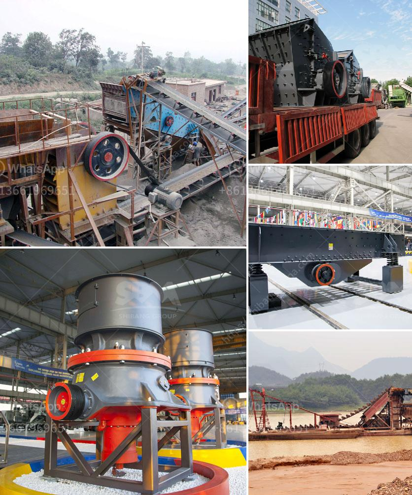

<h3>hammer crusher dimension</h3>
Hammer crushers are machines used to reduce the size of different types of materials in many industrial sectors. These compact and powerful machines are often utilized in construction, mining, and demolition projects to help break down larger pieces into smaller, more manageable pieces. One critical aspect of a hammer crusher is its dimension, as it determines the crusher's overall size and capacity. In this article, we will delve into the dimensions of a hammer crusher and how they impact its performance.

The dimension of a hammer crusher plays a crucial role in determining its efficiency and productivity. Generally, the dimensions of a hammer crusher include its length, width, and height. The overall length of a crusher affects its capacity to hold larger materials, while the width and height dimensions determine the maximum size of materials that can be fed into the crusher.

Typically, the length of a hammer crusher ranges from several meters to several tens of meters. A longer crusher allows for more hammers and greater crushing efficiency. Moreover, a longer dimension enables the crusher to accommodate larger feed sizes and process larger quantities of materials, which results in higher productivity. However, it is essential to strike a balance between the crusher's length and its portability, as longer crushers may be challenging to transport and operate in compact spaces.

The width and height dimensions of a hammer crusher are significant factors that determine the maximum size of the incoming materials. A wider crusher can effectively handle larger-sized materials, while a taller crusher accommodates taller items. These dimensions must be selected according to the specific type of materials being processed and the desired output size. It's important to note that while a crusher with larger dimensions can process bigger materials, it may be less efficient when dealing with smaller-sized materials. Therefore, the dimensions of a hammer crusher should be chosen in consideration of the type and size range of materials it will be handling.

In addition to these critical dimensions, other factors also come into play when determining the ideal dimension for a hammer crusher. The type and number of hammers, the rotor speed, and the clearance between the hammers and the crushing plates collectively impact the crushing efficiency and overall performance of the crusher. These factors should be optimized to achieve the desired output and minimize wear and tear on the machine.

In conclusion, the dimensions of a hammer crusher significantly impact its performance and productivity. A crusher's length, width, and height affect its capacity, maximum feed size, and overall efficiency. Selecting the appropriate dimensions for the specific application is crucial to ensure optimal performance and longevity of the crusher and to achieve the desired output size. Manufacturers and end-users must carefully evaluate the material types and size range they will be processing to determine the most suitable dimension for their hammer crusher.
<h3>Contact us</h3><ul><li><strong>Whatsapp:&nbsp;<a href="https://wa.me/8613661969651">+8613661969651</a></strong></li><li><a href="https://swt.shibang-china.com/?git&amp;zhl&amp;hammer crusher dimension"><strong>Online Service(chat now)</strong></a></li></ul><h3>Related</h3><ul><li><a href='china coal crusher high capacity.md'>china coal crusher high capacity</a></li><li><a href='mobile crusher plant price in india.md'>mobile crusher plant price in india</a></li><li><a href='mobile crusher in saudi arabia.md'>mobile crusher in saudi arabia</a></li><li><a href='used quarry equipment for sale in calgary canada.md'>used quarry equipment for sale in calgary canada</a></li><li><a href='process of setting of a stone crusher in orissa.md'>process of setting of a stone crusher in orissa</a></li></ul>