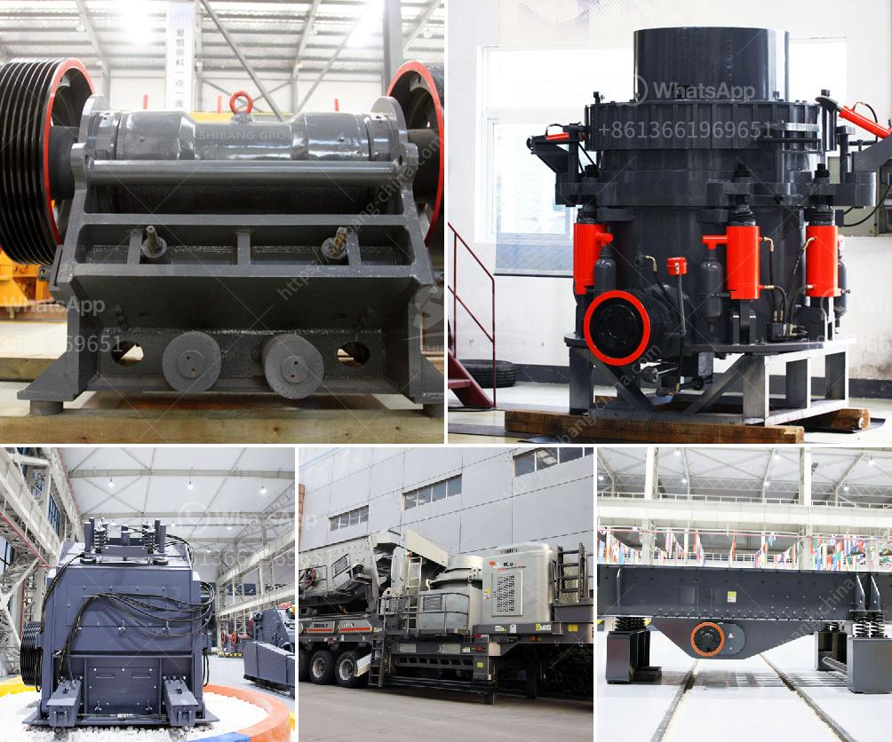

<h3>hammer crusher price one ton per hour</h3>
The hammer crusher is a widely used machine for crushing medium-hard materials into fine particles, which can be further processed by ball mills and other equipment for maximum utilization of resources. Hammer crushers are widely used in mining, cement, coal, metallurgy, building materials, highway, and other industries for crushing various materials with high efficiency and low maintenance costs.

One of the key factors that determine the cost of a hammer crusher is the capacity. These machines can be categorized into small, medium, and large-sized crushers based on their capacity. For instance, a small hammer crusher can be utilized for a one-ton per hour operation, while a large hammer crusher with a capacity of 900 tons per hour may cost up to several hundred thousand dollars.

When considering the price of a hammer crusher, it's also essential to factor in the features and specifications of the machine. A high-quality hammer crusher with durable components and functional safety features will generally cost more than a simple crusher with minimal features.

In terms of productivity, a one-ton per hour hammer crusher is ideal for small-scale operations such as quarries and construction sites. These machines can efficiently process various materials, including limestone, coal, gypsum, and more. However, the material's hardness, size, and moisture content can affect the crusher's output and efficiency.

Apart from the machine itself, there are additional costs that need to be considered when purchasing a hammer crusher. These include transportation costs, installation fees, and ongoing maintenance expenses. The availability of spare parts and the manufacturer's reputation for delivering high-quality products and customer service is also crucial factors to consider when determining the overall cost.

To ensure the longevity and performance of your hammer crusher, regular maintenance is vital. Components such as the hammer head, lining plate, and bearings require regular inspection and replacement to prevent unexpected breakdowns and costly repairs. Investing in routine maintenance not only extends the lifespan of the machine but also improves its overall efficiency.

It is worth noting that the price of a hammer crusher can vary significantly depending on the market demand, exchange rates, labor costs, and other economic factors. To ensure you are getting the best value for your money, it is advisable to compare prices from various suppliers while considering the quality of the products and after-sales services they offer.

In conclusion, the price of a one-ton per hour hammer crusher is influenced by factors such as capacity, features, maintenance requirements, and additional costs. Investing in a high-quality and efficient hammer crusher can significantly increase your productivity and minimize downtime in your operations. By considering these factors and doing thorough research, you can make an informed decision and find the best crusher that meets your requirements without exceeding your budget.
<h3>Contact us</h3><ul><li><strong>Whatsapp:&nbsp;<a href="https://wa.me/8613661969651">+8613661969651</a></strong></li><li><a href="https://swt.shibang-china.com/?git&amp;zhl&amp;hammer crusher price one ton per hour"><strong>Online Service(chat now)</strong></a></li></ul><h3>Related</h3><ul><li><a href='manufacturer of clinker grinding machine.md'>manufacturer of clinker grinding machine</a></li><li><a href='feldspar powder making.md'>feldspar powder making</a></li><li><a href='mobile cone crusher.md'>mobile cone crusher</a></li><li><a href='dolomite powder plant.md'>dolomite powder plant</a></li><li><a href='vibrating screen indonesia.md'>vibrating screen indonesia</a></li></ul>