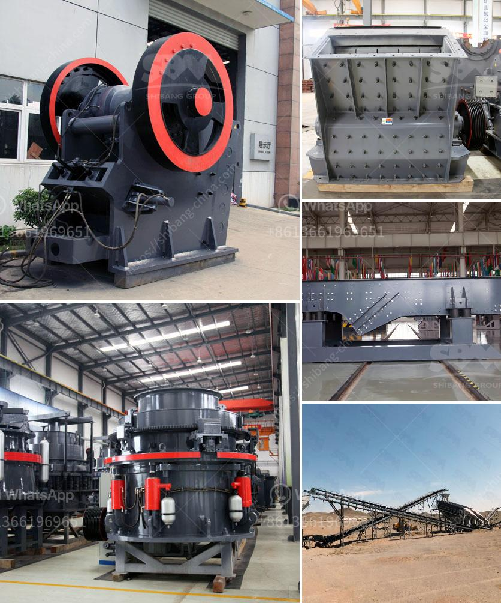

<h3>hammer for crushing concrete</h3>
When it comes to breaking down concrete, a hammer is an essential tool that offers unbeatable efficiency and precision. With its sturdy construction and powerful force, it is widely used in construction and demolition projects. Whether you are a professional contractor or a DIY enthusiast, having a reliable hammer for crushing concrete is a game-changer. In this article, we will delve into the functions, types, and benefits of using a hammer for this purpose.

A hammer is a versatile and robust device primarily designed for driving nails, removing or demolishing materials. When used to crush concrete, it showcases its true strength. With a heavy metal head attached to a handle, the user can apply extreme force to directly impact the concrete surface, causing fractures and breaking it into smaller pieces.

When it comes to choosing the right hammer for concrete crushing, several factors should be considered. Firstly, the size and weight of the hammer matter. Typically, a heavier hammer is more effective in terms of crushing the concrete, as it provides greater impact force. However, the user's physical strength should also be considered, as handling a heavy hammer for extended periods can lead to fatigue and may not be suitable for everyone.

Another crucial aspect is the type of hammer. There are various types available on the market, but the most commonly used for concrete crushing are the handheld electric hammer and the hydraulic hammer. The handheld electric hammer, also known as a breaker hammer or demolition hammer, is corded and operates on electricity. It is lightweight, easy to maneuver, and suitable for lighter concrete crushing tasks.

On the other hand, the hydraulic hammer is a heavy-duty tool that is most commonly used in professional construction and demolition projects. It is attached to an excavator or other heavy machinery, allowing for precise control and maximum force. The power of the hydraulic hammer comes from a hydraulic system, making it capable of breaking even the toughest concrete surfaces effortlessly.

Using a hammer for crushing concrete offers numerous benefits. Firstly, it accelerates the demolition process, saving time and effort. The hammer's impact force allows for quick and efficient concrete breaking, reducing the amount of manual labor required. Additionally, it enables the operator to have more control over the breaking process, resulting in cleaner and more precise cuts.

Furthermore, a hammer provides cost savings by minimizing the need for heavy machinery or multiple tools. With the right hammer, one can accomplish a variety of tasks, from crushing concrete to breaking up asphalt or removing tiles. This versatility eliminates the requirement for additional equipment and simplifies the overall construction or renovation process.

In conclusion, a hammer for crushing concrete is an invaluable tool in the construction industry. It offers efficiency, precision, and versatility, making it a must-have for contractors and DIY enthusiasts alike. By selecting the appropriate size and type of hammer, one can effortlessly break down concrete surfaces, opening up endless possibilities and saving both time and money. So, whether you are involved in a demolition project or simply looking to renovate your backyard, make sure to have a reliable hammer by your side.
<h3>Contact us</h3><ul><li><strong>Whatsapp:&nbsp;<a href="https://wa.me/8613661969651">+8613661969651</a></strong></li><li><a href="https://swt.shibang-china.com/?git&amp;zhl&amp;hammer for crushing concrete"><strong>Online Service(chat now)</strong></a></li></ul><h3>Related</h3><ul><li><a href='brushes for conveyor belts.md'>brushes for conveyor belts</a></li><li><a href='roller mill process machine.md'>roller mill process machine</a></li><li><a href='products pe jaw crusher.md'>products pe jaw crusher</a></li><li><a href='famous crusher and grinder manufacturer france.md'>famous crusher and grinder manufacturer france</a></li><li><a href='stamp mill machine south africa.md'>stamp mill machine south africa</a></li></ul>