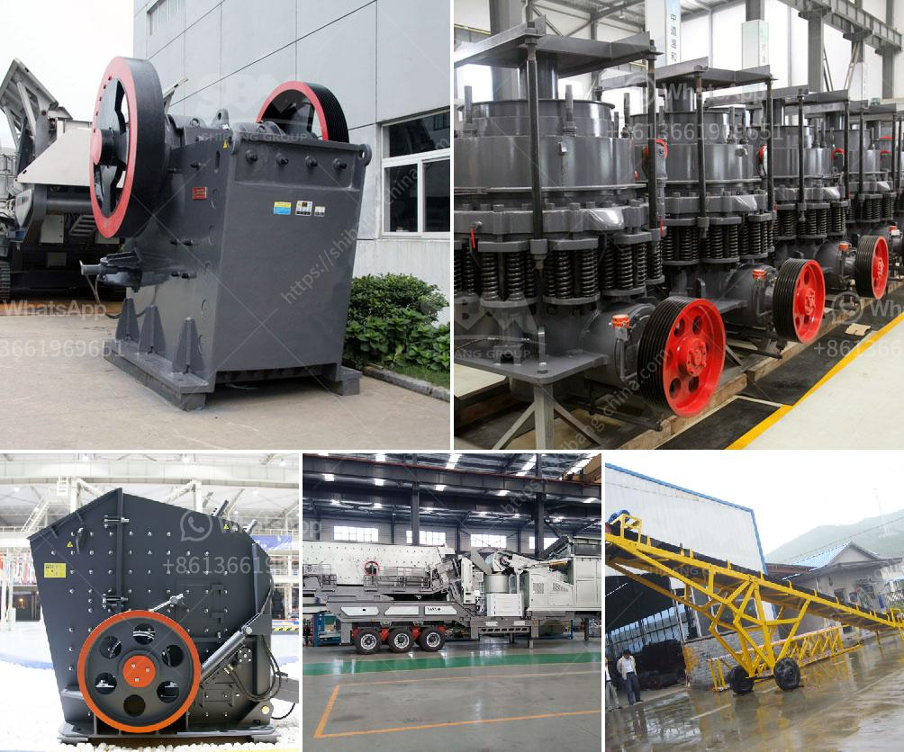

<h3>hammer mill dealer in cebu</h3>
Cebu, also known as the "Queen City of the South," is rich in agricultural resources. From its vast sugarcane plantations to diverse livestock farms, the province plays a vital role in the country's agricultural sector. One essential tool that supports these agricultural activities is the hammer mill.

A hammer mill is a machine that crushes and pulverizes agricultural materials into smaller pieces for easier transportation and processing. It is an invaluable tool used by farmers and livestock owners to efficiently produce animal feed, biomass, and other essential agricultural products.

In Cebu, there are various reliable hammer mill dealers that provide a wide range of options to cater to the unique needs of the agricultural industry in the province. These dealers offer high-quality and durable hammer mills that are built to withstand the demanding conditions of farm operations.

One reputable dealer in Cebu is ABC Machinery. They are known for their expertise in the manufacture and distribution of agricultural machinery, including hammer mills. ABC Machinery offers different models and sizes of hammer mills to suit various farming requirements. They also provide after-sales support and spare parts to ensure uninterrupted operation and a prolonged lifespan of the equipment.

Another trusted hammer mill dealer in Cebu is Prime Machinery Corporation. With years of experience in the industry, they offer an extensive selection of hammer mills designed for efficient and reliable performance. Their team of experts can also provide personalized guidance to help customers choose the most suitable hammer mill for their specific needs.

Aside from ABC Machinery and Prime Machinery Corporation, there are several other hammer mill dealers in Cebu that farmers and livestock owners can explore. The presence of multiple dealers creates healthy competition, driving innovation and ensuring customers receive top-quality products at competitive prices.

In conclusion, the hammer mill is an essential tool for farmers and livestock owners in Cebu. With a variety of reputable dealers in the province, individuals can find the perfect hammer mill that suits their agricultural needs. These dealers offer a wide range of options, ensuring customers can efficiently produce animal feed and other agricultural products. Investing in a quality hammer mill from a reliable dealer is an excellent way to enhance productivity and profitability in the agricultural sector in Cebu.
<h3>Contact us</h3><ul><li><strong>Whatsapp:&nbsp;<a href="https://wa.me/8613661969651">+8613661969651</a></strong></li><li><a href="https://swt.shibang-china.com/?git&amp;zhl&amp;hammer mill dealer in cebu"><strong>Online Service(chat now)</strong></a></li></ul><h3>Related</h3><ul><li><a href='how to make clay from powder clay.md'>how to make clay from powder clay</a></li><li><a href='quartz stone quarry crusher in nigeria.md'>quartz stone quarry crusher in nigeria</a></li><li><a href='ball mill in wait of ball.md'>ball mill in wait of ball</a></li><li><a href='industrial application ball mill.md'>industrial application ball mill</a></li><li><a href='mobile gold crusher plant.md'>mobile gold crusher plant</a></li></ul>