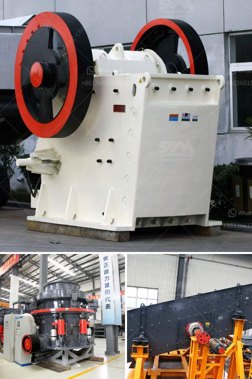

<h3>hammer mill equipment</h3>
The hammer mill equipment is a type of grinding machine used for shredding or crushing a wide range of materials. It is an important machine in many industries, including the agriculture, biomass, and mining sectors. In addition to grinding and crushing, this equipment is also capable of producing a wide range of particle sizes.

One of the key features of a hammer mill is its versatility. With different types of screens, the machine can produce various particle sizes. This makes it suitable for a variety of applications, such as feed production, biomass pellet production, and size reduction of bulk materials. The versatility of the machine allows it to handle different types and sizes of raw materials, resulting in reduced labor and increased efficiency.

In the agriculture sector, the hammer mill equipment is commonly used for grinding grains, such as corn, wheat, and barley, to produce livestock feed. It is also used for grinding crops, such as hay and straw, for bedding and feed. The ability to produce different particle sizes is particularly beneficial in the feed industry, as it allows for better control of feed quality and nutritional value.

Additionally, the hammer mill equipment is widely used in the biomass industry. It is used to grind and convert biomass materials, such as wood chips, sawdust, and agricultural residues, into a finer form suitable for pelletizing or briquetting. This process, known as size reduction, enhances the fuel properties of biomass, making it an efficient and sustainable alternative to fossil fuels.

Furthermore, the hammer mill equipment is also utilized in various industrial applications. It is commonly used in the mining sector for crushing and grinding ores to extract valuable minerals. The machine can also be used to pulverize materials, such as coal and limestone, for industrial applications like cement production and power generation.

The hammer mill equipment offers several advantages over other grinding machines. Firstly, it is relatively cost-effective, making it suitable for small to medium-scale operations. The machine is also easy to operate and maintain, requiring minimal training and maintenance. Additionally, its compact size makes it easy to integrate into existing production lines or workspaces.

In terms of sustainability, the hammer mill equipment contributes to resource conservation and waste reduction. By grinding or crushing materials, it allows for better utilization of raw materials and reduces waste disposal. In the case of biomass, converting it into a finer form increases its efficiency as a renewable energy source.

In conclusion, the hammer mill equipment is a versatile and essential tool in the agriculture and industrial sectors. Its ability to grind and crush a wide range of materials makes it suitable for various applications, including feed production, biomass processing, and size reduction. The machine's versatility, cost-effectiveness, and sustainability contribute to its popularity in different industries. Whether in the field of agriculture, biomass, or mining, the hammer mill equipment plays a crucial role in enhancing productivity and sustainability.
<h3>Contact us</h3><ul><li><strong>Whatsapp:&nbsp;<a href="https://wa.me/8613661969651">+8613661969651</a></strong></li><li><a href="https://swt.shibang-china.com/?git&amp;zhl&amp;hammer mill equipment"><strong>Online Service(chat now)</strong></a></li></ul><h3>Related</h3><ul><li><a href='250 tph mobile stone crusher price in india.md'>250 tph mobile stone crusher price in india</a></li><li><a href='used jaw crushers from oman.md'>used jaw crushers from oman</a></li><li><a href='roll crushers for rent.md'>roll crushers for rent</a></li><li><a href='marble quarry business plan.md'>marble quarry business plan</a></li><li><a href='ball milling machines suppliers in egypt.md'>ball milling machines suppliers in egypt</a></li></ul>