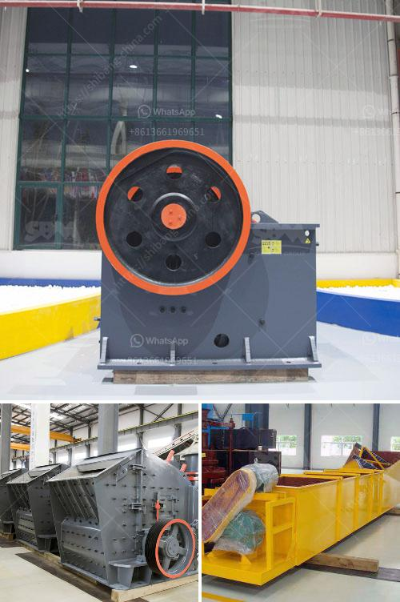

<h3>hammer mill machine price</h3>
Hammer mill machines are used to shred or crush materials into smaller pieces. They are essential machines in various industries, including mining, forestry, and waste management. However, when it comes to purchasing a hammer mill machine, one crucial factor to consider is the price. In this article, we will explore the factors that affect the price of a hammer mill machine and why it is important to be aware of the price range before making a purchase.

The price of a hammer mill machine can vary greatly depending on factors such as the brand, size, and capacity. Different brands offer different quality and performance levels, which ultimately affect the price range. Generally, well-known brands tend to have higher prices due to their reputation and established customer base. However, it is essential to research and compare prices from various brands to ensure that you are getting the best value for your money.

The size of the hammer mill machine also plays a significant role in determining its price. Larger machines with higher capacity tend to be more expensive than smaller ones. The capacity refers to the amount of material that the machine can process per hour. If you have a high volume of material to process, investing in a larger machine might be more cost-effective in the long run. However, if you have a lower volume of material, a smaller and more affordable machine might be a sensible choice.

Another factor that affects the price is the specific features and attachments that come with the hammer mill machine. Some machines come with additional features such as adjustable speed, automatic feeding systems, and safety mechanisms. These added features can increase the functionality and convenience of the machine, but they also contribute to a higher price. It is important to consider your specific needs and budget when deciding whether to invest in a machine with extra features or opt for a basic model.

When considering the price of a hammer mill machine, it is crucial to assess the overall quality and durability of the machine. A lower-priced machine may seem attractive initially, but it could prove to be more expensive in the long run if it requires frequent repairs and replacement parts. Look for a machine made from high-quality materials, with good reviews and feedback from other users. Investing in a reliable and durable machine will ensure that it operates efficiently and effectively for a longer period.

In conclusion, the price of a hammer mill machine is a crucial factor to consider before making a purchase. Factors such as brand, size, capacity, features, and overall quality all contribute to the price range. It is important to research and compare prices from different brands to find the best value for your money. Additionally, consider your specific needs and budget when deciding on the size and features of the machine. By taking these factors into account, you can make an informed decision and invest in a hammer mill machine that meets your requirements and offers long-term value.
<h3>Contact us</h3><ul><li><strong>Whatsapp:&nbsp;<a href="https://wa.me/8613661969651">+8613661969651</a></strong></li><li><a href="https://swt.shibang-china.com/?git&amp;zhl&amp;hammer mill machine price"><strong>Online Service(chat now)</strong></a></li></ul><h3>Related</h3><ul><li><a href='quartz stone pulverizer.md'>quartz stone pulverizer</a></li><li><a href='ballast crusher machine.md'>ballast crusher machine</a></li><li><a href='used raymond mills barite raymond mill.md'>used raymond mills barite raymond mill</a></li><li><a href='portable gold recovery mill for sale.md'>portable gold recovery mill for sale</a></li><li><a href='mining equipment agent in iran.md'>mining equipment agent in iran</a></li></ul>