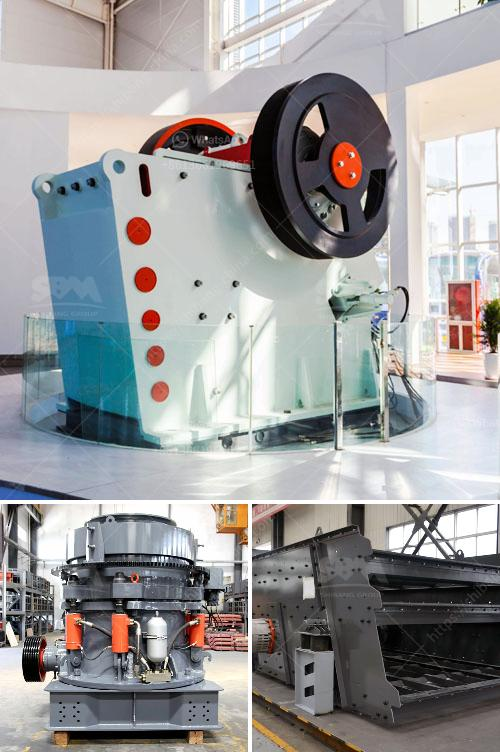

<h3>hammer mill machine south africa</h3>
The South African market has a wide range of hammer mills machines. Hammer mills are equipped with various cutting and grinding tools, such as hammers, blades, and screens. It is capable of grinding and milling various types of materials ranging from maize and corn to lucerne and grass. Farmers have been relying on hammer mills to grind their crops and obtain livestock feed for many years, making it an essential machine in the agricultural industry.

One of the key players in the South African hammer mill industry is ABC Hansen Africa. The company has been manufacturing and selling hammer mills since 1928, initially focusing on the agriculture sector as a supplier of a wide range of agricultural equipment. Over the years, they have expanded their product line to meet the needs of other industries, such as maize mills, oil mills, and various industrial applications.

The hammer mill machine manufactured by ABC Hansen Africa is based on decades of experience in the milling industry. This robust and reliable mill is designed to grind and mill various types of materials, ensuring consistent and high-quality end products. It is well-suited for small-scale farmers, as well as medium and large-scale industrial operations.

One of the advantages of using a hammer mill machine is its versatility. It can handle a wide range of materials, from grains like maize and corn to roughage such as lucerne and grass. This flexibility makes it an ideal choice for farmers who need to grind various types of feed for their livestock. Different screen sizes can be used to obtain the desired particle size and texture, ensuring optimal feed conversion rates and animal health.

In addition to its versatility, the hammer mill machine is also known for its efficiency. Its cutting and grinding tools, combined with its high-speed operation, allow for quick and efficient processing of materials. This results in higher productivity and lower energy consumption compared to traditional milling methods.

Furthermore, hammer mills are relatively easy to operate and maintain. They require minimal training and expertise, making them accessible to both experienced farmers and newcomers to the agricultural industry. The machine's design and construction are also durable, ensuring a long lifespan and minimal downtime.

ABC Hansen Africa offers comprehensive after-sales service and support for its hammer mills. Their team of experts is available to assist customers with installation, maintenance, and troubleshooting. The company also stocks a wide range of spare parts, ensuring prompt and efficient repairs when needed.

In conclusion, hammer mill machines have become an essential part of the South African agricultural industry. From grinding and milling grains for livestock feed to processing crops for various industrial applications, these machines offer versatility, efficiency, and ease of use. With reputable manufacturers like ABC Hansen Africa providing quality machines and excellent after-sales service, farmers and industrial operators can rely on hammer mills to meet their grinding and milling needs.
<h3>Contact us</h3><ul><li><strong>Whatsapp:&nbsp;<a href="https://wa.me/8613661969651">+8613661969651</a></strong></li><li><a href="https://swt.shibang-china.com/?git&amp;zhl&amp;hammer mill machine south africa"><strong>Online Service(chat now)</strong></a></li></ul><h3>Related</h3><ul><li><a href='calcite micronizer machine manufacturer.md'>calcite micronizer machine manufacturer</a></li><li><a href='nigeria rock crushing plant.md'>nigeria rock crushing plant</a></li><li><a href='crushing equipment manufacturers.md'>crushing equipment manufacturers</a></li><li><a href='quarry crusher business in south africa.md'>quarry crusher business in south africa</a></li><li><a href='powder grinding machines philippines.md'>powder grinding machines philippines</a></li></ul>