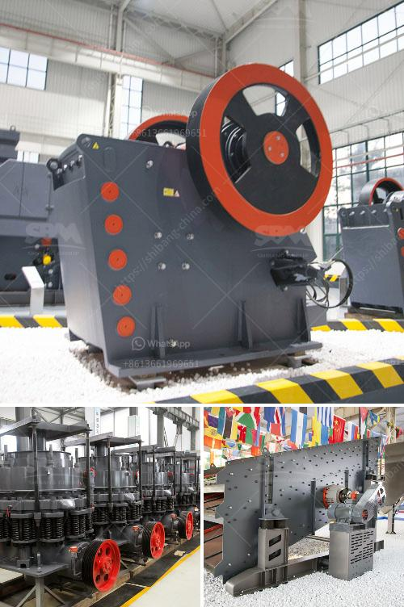

<h3>hammer mill price philippines</h3>
The hammer mill price Philippines is a common topic among buyers. These machines have certain specifications and are valued for their salient features. If you are interested in purchasing a hammer mill but don't know where to begin, this article should help.

First, know that typically, the hammer mill price Philippines will depend on several factors. These include the design, capacity, brand, and quality of the machine. Some machines may cost several thousand dollars while others may be priced at a fraction of that amount. It is important to set a budget and determine your needs before starting your search.

Next, consider the capacity of the hammer mill. How much material will it be able to process in a given time frame? This is an important factor to consider if you are looking to process large quantities of materials. Be sure to inquire about the capacity of the machine before making your purchase.

Brands can also play a role in determining the price of a hammer mill. Some brands are known for their quality and reliability, while others may be relatively new in the market. Choosing a reputable brand can help ensure that your machine will perform efficiently and last for a long time.

Lastly, quality should be a top consideration. A low-priced hammer mill may save you money initially, but it may not last as long or perform as well as a higher-priced machine. Consider the materials used in the construction of the mill, as well as the overall craftsmanship.

In conclusion, finding the right hammer mill at the right price can be a challenging task. Take the time to do your research, compare prices, and consider the important factors mentioned above. By doing so, you will be able to make an informed decision and find a hammer mill that suits your needs and budget.
<h3>Contact us</h3><ul><li><strong>Whatsapp:&nbsp;<a href="https://wa.me/8613661969651">+8613661969651</a></strong></li><li><a href="https://swt.shibang-china.com/?git&amp;zhl&amp;hammer mill price philippines"><strong>Online Service(chat now)</strong></a></li></ul><h3>Related</h3><ul><li><a href='how to design stone crusher building.md'>how to design stone crusher building</a></li><li><a href='limestone rock crusher.md'>limestone rock +crusher</a></li><li><a href='grinding silica sand process.md'>grinding silica sand process</a></li><li><a href='price conveyor belts in malaysia.md'>price conveyor belts in malaysia</a></li><li><a href='processing of platinum ore flow sheet.md'>processing of platinum ore flow sheet</a></li></ul>