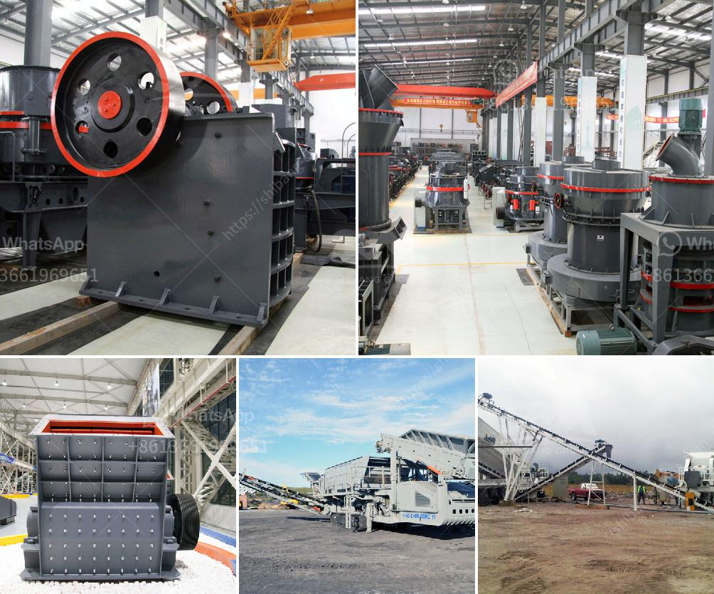

<h3>hammer mill price south africa</h3>
The production of feed for livestock, including poultry, swine, and cattle, plays a crucial role in ensuring their growth and overall health. One essential tool used in the production process is the hammer mill. This machine is used to grind or crush materials into small particles, enabling easy consumption by animals.

Hammer mills are widely used in various industries, such as mining, forestry, and construction. In South Africa, the demand for these machines has been on the rise, especially for livestock farming. However, how much does a hammer mill cost in South Africa?

The price of a hammer mill in South Africa varies depending on the make and model, as well as the capacity and power output. Some smaller models may only cost a few thousand dollars, while larger, more advanced models can cost tens of thousands of dollars.

1. Capacity: The capacity of a hammer mill refers to its production capability, typically measured in tons per hour. Higher capacity models typically have a higher price due to their ability to process larger quantities of materials at a faster rate.

2. Power output: The power output of a hammer mill is measured in kilowatts (kW). Higher power output generally means a higher price, as more powerful machines can handle tougher and denser materials with ease.

3. Features and technology: Hammer mills with advanced features and cutting-edge technology are generally higher priced. These features may include digital controls, automated feeding systems, and built-in dust extraction systems.

4. Brand reputation: Just like any other product, the reputation of the brand can impact the price of a hammer mill. Well-established brands with a strong track record of reliability and quality may come with a higher price tag.

5. Maintenance and warranty: Hammer mills require regular maintenance to ensure their longevity and optimal performance. Hammer mills with extended warranty periods or comprehensive maintenance packages may have a higher initial price but provide a higher level of peace of mind.

When considering the purchase of a hammer mill in South Africa, it is essential to evaluate specific factors such as the capacity, power output, features, brand reputation, and maintenance requirements. It is advisable to research and compare different models and suppliers to find the best option that meets your needs and budget.

Additionally, it is worth considering the ongoing operational costs associated with a hammer mill. These costs include energy consumption, spare parts, and general maintenance. While a lower-priced hammer mill may seem appealing initially, it is essential to consider the long-term operating costs associated with the machine.

In conclusion, the price of a hammer mill in South Africa can vary significantly depending on various factors such as capacity, power output, features, brand reputation, and maintenance requirements. It is crucial to evaluate these factors and consider the long-term operational costs to make an informed decision. Nonetheless, investing in a reliable and high-quality hammer mill is essential for efficient livestock feed production and the overall success of farms in South Africa.
<h3>Contact us</h3><ul><li><strong>Whatsapp:&nbsp;<a href="https://wa.me/8613661969651">+8613661969651</a></strong></li><li><a href="https://swt.shibang-china.com/?git&amp;zhl&amp;hammer mill price south africa"><strong>Online Service(chat now)</strong></a></li></ul><h3>Related</h3><ul><li><a href='stone crushers hydraulic.md'>stone crushers hydraulic</a></li><li><a href='crusher industrial jaw crusher information.md'>crusher industrial jaw crusher information</a></li><li><a href='grinding machine for calciun carbinate from germany.md'>grinding machine for calciun carbinate from germany</a></li><li><a href='hammer for crushing concrete.md'>hammer for crushing concrete</a></li><li><a href='sample of project proposal in mining.md'>sample of project proposal in mining</a></li></ul>