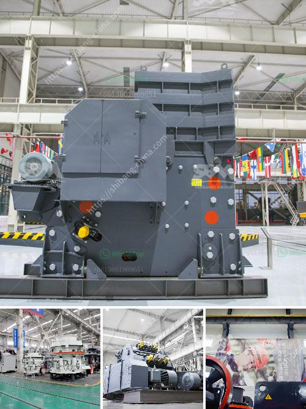

<h3>hammer mill technical specification</h3>
A hammer mill is a versatile machine that is used in various industries. One of the key technical specifications for this machine is its size and capacity, which determines its efficiency in operation. Larger mills have the advantage of generating higher throughput rates, while smaller ones are preferred for finer grinding of materials.

The overall size of a hammer mill is usually determined by the rotor diameter and the width of the grinding chamber. Rotor diameter can range from 300 to 900 millimeters, and the width of the grinding chamber can be between 300 and 600 millimeters. These dimensions are directly related to the machine's capacity and the size of materials it can effectively process.

Another important technical specification for a hammer mill is its horsepower rating. The horsepower determines the maximum horsepower capacity of the machine and is directly related to its efficiency and functionality. Hammer mills typically range in horsepower from 15 to 250, and the higher the horsepower, the greater the capacity and efficiency.

The type of hammer mill also plays a significant role in determining the technical specifications. For instance, a hammer mill with a gravity discharge has a simpler design and requires less operational input, making it suitable for small to medium-sized operations. On the other hand, a hammer mill with an air-swept style design uses a combination of airflow and mechanical force to grind materials and is better suited for larger operations requiring higher capacities.

Lastly, the material of construction and durability of a hammer mill should also be considered. Hammer mills come in various construction materials, such as stainless steel, carbon steel, and abrasion-resistant steel, which determines the reliability and lifespan of the machine.

In conclusion, the technical specifications of a hammer mill, including size, capacity, horsepower, type, and construction materials, determine its efficiency and suitability for various grinding operations. It is essential to carefully analyze these specifications to select the right hammer mill for a particular industry or application.
<h3>Contact us</h3><ul><li><strong>Whatsapp:&nbsp;<a href="https://wa.me/8613661969651">+8613661969651</a></strong></li><li><a href="https://swt.shibang-china.com/?git&amp;zhl&amp;hammer mill technical specification"><strong>Online Service(chat now)</strong></a></li></ul><h3>Related</h3><ul><li><a href='cement plant layout consultants in south africa.md'>cement plant layout consultants in south africa</a></li><li><a href='used crusher machines from china.md'>used crusher machines from china</a></li><li><a href='ceramic mortar powder grinding mill in nigeria.md'>ceramic mortar powder grinding mill in nigeria</a></li><li><a href='zambia mining conveyor belt.md'>zambia mining conveyor belt</a></li><li><a href='crusher manufacturers in malaysia.md'>crusher manufacturers in malaysia</a></li></ul>