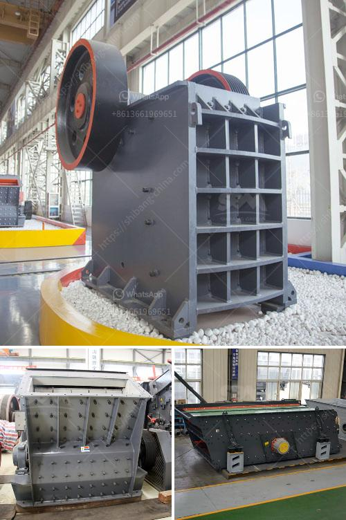

<h3>hammer mill technical</h3>
A hammer mill is a machine used in the field of crushing and pulverizing materials. It is designed to operate on a variety of materials, including soft, abrasive, and fibrous materials. The hammer mill uses a series of hammer-like blades, or hammers, mounted on a central shaft to strike and shatter the material. The size reduction is achieved through the impact of the hammers and the shearing action between the hammers and the screen.

Hammer mills are capable of producing a wide range of particle sizes. They work on the principle of rapid impact, where the material is reduced in size by a series of fast-moving hammers that collide with the particles as they pass through the mill. The hammers strike the material with sufficient force to shatter it into smaller pieces, and the particles are then forced through a screen that controls the size of the final product.

One of the key advantages of hammer mills is their versatility. They can be used for a wide range of applications, including crushing or pulverizing materials such as grains, animal feed, minerals, and wood. They are commonly used in the agricultural and food processing industries, as well as in recycling plants and chemical manufacturing facilities.

Hammer mills are available in various configurations, depending on the intended use. Some hammer mills have large hammers that are rigidly attached to the central shaft, while others have hammers that are hinged or pivot on a centrally mounted rotor. The choice of hammer mill configuration depends on the desired particle size and the properties of the materials being processed.

Another important feature of hammer mills is their ease of maintenance. The hammers and screens are easily replaceable and can be changed to adjust the particle size. Additionally, the grinding chamber can be opened for inspection or cleaning, allowing for quick and easy maintenance. This makes the hammer mill a reliable and cost-effective solution for many applications.

In conclusion, a hammer mill is a versatile machine that is capable of crushing and pulverizing a wide range of materials. It is commonly used in various industries, including agriculture, food processing, recycling, and chemical manufacturing. The hammer mill works on the principle of rapid impact, where hammers strike the material to shatter it into smaller pieces. The particle size is controlled by the screen, and the machine is easily maintained. Overall, the hammer mill is a valuable tool in many industrial processes.
<h3>Contact us</h3><ul><li><strong>Whatsapp:&nbsp;<a href="https://wa.me/8613661969651">+8613661969651</a></strong></li><li><a href="https://swt.shibang-china.com/?git&amp;zhl&amp;hammer mill technical"><strong>Online Service(chat now)</strong></a></li></ul><h3>Related</h3><ul><li><a href='cone crusher in america.md'>cone crusher in america</a></li><li><a href='mobile crushers for sale in south africa.md'>mobile crushers for sale in south africa</a></li><li><a href='quartz powder making machine in andhra pradesh.md'>quartz powder making machine in andhra pradesh</a></li><li><a href='price of plants crushing.md'>price of plants crushing</a></li><li><a href='slag crusher machine.md'>slag crusher machine</a></li></ul>