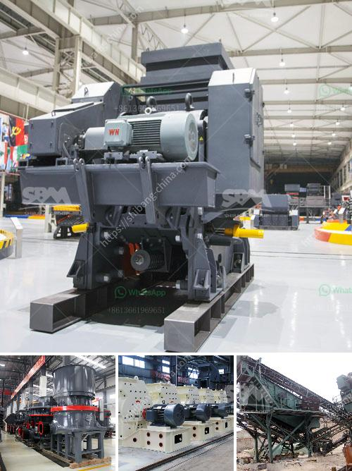

<h3>hammer milling disadvantages</h3>
Hammer milling is a widely-used and versatile size reduction technique that involves the use of a series of hammer-shaped hammers which rotate at high speeds in a chamber. Typically, this type of milling is used to grind grains, herbs, spices, and many other materials, but it has several disadvantages that must be considered before implementing it in any manufacturing process.

One of the main disadvantages of hammer milling is the potential for damage to the material being processed. Fragile materials such as grains and seeds can be easily shattered or crushed by the hammers, resulting in a loss of product quality or reduction in overall yield. Likewise, materials with a high moisture content can become sticky and adhere to the hammers, leading to clogging and reduced efficiency.

Additionally, hammer milling can generate excessive heat, which can be detrimental to the materials involved. Heat can cause chemical changes in certain substances, compromising their integrity and altering their properties. This is particularly important when dealing with heat-sensitive materials that need to be preserved in their original state, such as certain pharmaceuticals or food ingredients.

Another disadvantage of hammer milling is the implementation of a sieving or screening mechanism to obtain the desired product particle size. Due to the random nature of hammer impacts, it is challenging to achieve a precise and consistent particle size distribution without additional equipment. Moreover, the sieving process can be time-consuming and labor-intensive, adding to the overall cost and complexity of the milling operation.

In addition to these operational challenges, maintenance and cleaning are also significant concerns when it comes to hammer milling. The hammers, screens, and other internal components are subject to wear and tear over time, resulting in the need for regular replacements or repairs. This not only adds to the cost of maintenance but also leads to downtime and interruptions in production.

Furthermore, hammer milling may not be the most energy-efficient size reduction method available. The high rotational speed of the hammers requires a significant amount of energy, resulting in increased power consumption. This can have a negative impact on overall production costs and contribute to a company's carbon footprint.

Lastly, noise pollution is an inherent problem associated with hammer milling. The high-speed rotation of the hammers generates a considerable amount of noise, which can be disruptive to workers and cause discomfort in the surrounding environment. This may require additional measures, such as sound insulation or hearing protection, to ensure a safe and comfortable workspace.

In conclusion, while hammer milling is a widely-used and versatile size reduction technique, it has several disadvantages that must be carefully considered before implementation. These include the potential for damage to the material, generation of excessive heat, the need for additional equipment for sieving, maintenance and cleaning requirements, high energy consumption, and noise pollution. By understanding these drawbacks, manufacturers can make informed decisions about their milling processes and explore alternative methods that may be more suitable for their specific applications.
<h3>Contact us</h3><ul><li><strong>Whatsapp:&nbsp;<a href="https://wa.me/8613661969651">+8613661969651</a></strong></li><li><a href="https://swt.shibang-china.com/?git&amp;zhl&amp;hammer milling disadvantages"><strong>Online Service(chat now)</strong></a></li></ul><h3>Related</h3><ul><li><a href='pakistan crusher machine complete.md'>pakistan crusher machine complete</a></li><li><a href='iron ore washing plant.md'>iron ore washing plant</a></li><li><a href='limestone grinding equipment.md'>limestone grinding equipment</a></li><li><a href='industrial application ball mill.md'>industrial application ball mill</a></li><li><a href='list of machinery used for open pit mining.md'>list of machinery used for open pit mining</a></li></ul>