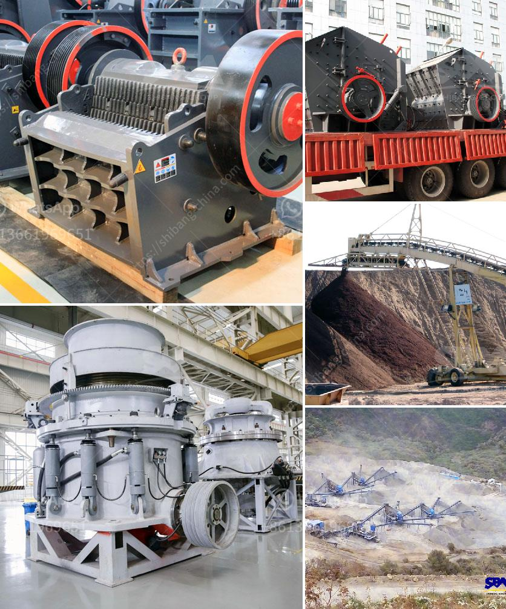

<h3>hand powered rock crusher binq mining</h3>
Mining operations, whether small or large scale, heavily rely on mechanized equipment to maximize efficiency and productivity. However, not all mining endeavors can afford high-end machinery or sophisticated technology. In such cases, hand-powered rock crushers prove to be a viable alternative, delivering crushing power without the need for costly energy consumption. This article explores the advantages and features of hand-powered rock crushers, shedding light on their relevance in small-scale mining operations.

Hand-powered rock crushers are remarkable for their efficiency and portability, allowing operators to bring the crusher to the material, rather than having to haul it out to a stationary processing plant. This eliminates the need for transportation costs and reduces reliance on external power sources, making it a practical and economical choice for small-scale miners.

These crushers are designed to be user-friendly, requiring minimal technical knowledge or experience to operate. A simple crank mechanism allows operators to easily crush rocks into smaller pieces, ensuring a consistent feed size suitable for subsequent processing. With fewer mechanical parts, hand-powered rock crushers are also easier and cheaper to maintain than their larger, motorized counterparts, contributing to reduced downtime and increased operational efficiency.

Hand-powered rock crushers are designed to crush various types of stones and minerals, making them ideal for small-scale mining activities such as gold extraction. Whether employed as a primary crusher or secondary crusher, the device can process various materials and produce different particle sizes. This versatility enables miners to extract a wider range of minerals with a single machine, optimizing resources and reducing overall costs.

Unlike gas-powered or electric crushers, hand-powered rock crushers operate without reliance on fossil fuels, lowering their environmental impact. This eco-friendly feature aligns with the growing trend of sustainable mining practices, allowing miners to reduce emissions and contribute to global efforts in combatting climate change. Additionally, as hand-powered crushers are designed for small-scale mining operations, their overall impact on the environment is minimal compared to larger-scale crushing equipment.

One of the key advantages of hand-powered rock crushers is their affordability. These devices are significantly cheaper than their motorized counterparts, making them accessible to small-scale miners who may have limited financial resources. By reducing the initial investment required, these crushers provide an accessible entry point into mining for individuals and communities residing in resource-rich areas with limited access to capital.

In the quest for sustainable and cost-effective mining practices, hand-powered rock crushers offer a practical solution for small-scale miners. Versatile, efficient, and easy to maintain, these devices enable operators to extract a wide range of minerals while minimizing environmental impact and lowering operational costs. With their affordability and accessibility, hand-powered rock crushers empower small-scale miners to participate in responsible and profitable mining activities, ultimately contributing to local economic development.
<h3>Contact us</h3><ul><li><strong>Whatsapp:&nbsp;<a href="https://wa.me/8613661969651">+8613661969651</a></strong></li><li><a href="https://swt.shibang-china.com/?git&amp;zhl&amp;hand powered rock crusher binq mining"><strong>Online Service(chat now)</strong></a></li></ul><h3>Related</h3><ul><li><a href='crushing equipment for rent.md'>crushing equipment for rent</a></li><li><a href='quarry machinery manufacturers.md'>quarry machinery manufacturers</a></li><li><a href='stone crusher capsule.md'>stone crusher capsule</a></li><li><a href='specification jaw crusher.md'>specification jaw crusher</a></li><li><a href='stone crushers made in china.md'>stone crushers made in china</a></li></ul>