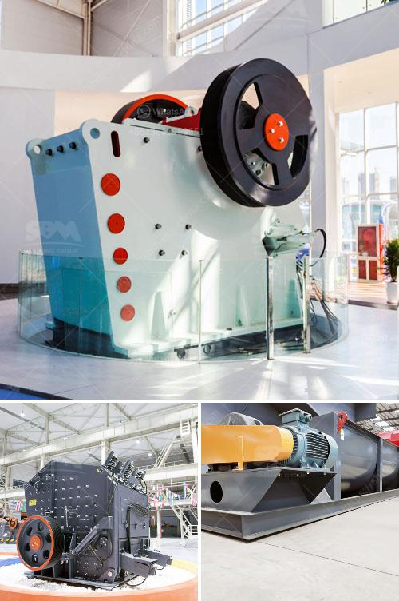

<h3>hgm micro powder grinding mill</h3>
The HGM micro powder grinding mill is a new type of stone powder processing equipment developed through more than 20 years of research and innovation by CLIRIK Machinery. It combines the advantages and advanced technologies of various mills at home and abroad. It has been widely used in the fields of metallurgy, mining, chemical industry, building materials, and other industries. 

Firstly, the HGM micro powder grinding mill is energy-saving. The motor of the main unit drives the main shaft and the turntable to rotate through the reducer, and the roller pins on the edge of the turntable drive dozens of grinding rollers to roll in the grinding ring track. Under the same finished product fineness and motor power, the output of the HGM micro powder grinding mill is 40% higher than that of the air-flow mill and the stirring mill, and the energy consumption of the system is only 30% of the air-flow mill.

Secondly, the HGM micro powder grinding mill has a wide range of applications. It can grind non-flammable and explosive materials with Mohs hardness below 7 and humidity within 6%, such as calcite, marble, limestone, dolomite, activated carbon, bentonite, kaolin, graphite, talc, mica, magnesite, illite, pyrophyllite, vermiculite, sepiolite, attapulgite, rectorite, diatomaceous earth, barite, gypsum, alunite, graphite, fluorite, phosphate rock, potassium ore, pumice, etc. The finished product size can be adjusted between 325 and 3000 meshes, and the processing capacity can reach 0.4-30t/h.

Thirdly, the HGM micro powder grinding mill has high grinding efficiency. The grinding roller rolls closely on the grinding ring under the action of centrifugal force, so the grinding pressure is increased by 1.2 times compared with the Raymond mill under the same power conditions, and the output is increased by more than 20% with the same fineness. The material can be ground to 0.033mm (425 mesh) at one time, which has a good particle size and a wide particle size distribution.

In addition, the HGM micro powder grinding mill is equipped with a pulse dust collector, which greatly reduces dust pollution and noise, and the dust removal efficiency is as high as 99.9%. The grinding chamber adopts a unique air separation device, which eliminates the air volume required by the traditional mill and effectively reduces the air resistance, making the equipment more stable and reliable.

In conclusion, the HGM micro powder grinding mill is a new type of advanced grinding equipment, which has been widely used in various industries. It has the advantages of energy saving, wide application, high grinding efficiency, and low environmental pollution. It can meet the needs of various materials for grinding and processing, and has broad development prospects in the future.
<h3>Contact us</h3><ul><li><strong>Whatsapp:&nbsp;<a href="https://wa.me/8613661969651">+8613661969651</a></strong></li><li><a href="https://swt.shibang-china.com/?git&amp;zhl&amp;hgm micro powder grinding mill"><strong>Online Service(chat now)</strong></a></li></ul><h3>Related</h3><ul><li><a href='spare parts rollers xzm ultrafine mill.md'>spare parts rollers xzm ultrafine mill</a></li><li><a href='mobile crusher price algerie.md'>mobile crusher price algerie</a></li><li><a href='jaw crusher manufacturer in china.md'>jaw crusher manufacturer in china</a></li><li><a href='standard operating procedure for coal pulverizer.md'>standard operating procedure for coal pulverizer</a></li><li><a href='stone crushing equipment south africa.md'>stone crushing equipment south africa</a></li></ul>