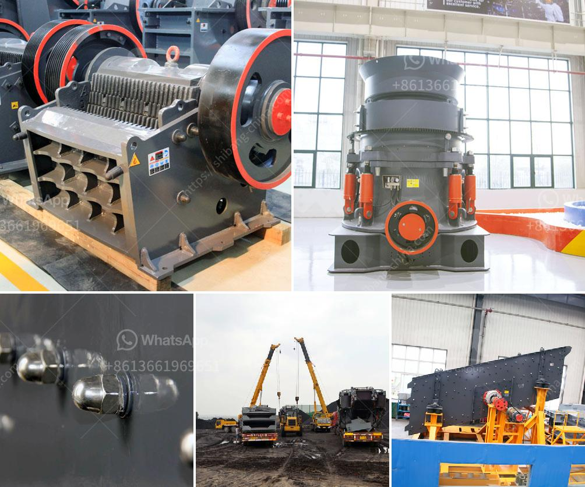

<h3>high capacity fine stone quarry crusher machine</h3>
In recent years, with the rapid development of the construction industry, the demand for construction materials has increased significantly. As a result, the demand for quarry crushers, which are essential equipment in the mining and construction industries, has also grown rapidly. Among the various types of quarry crushers, the high capacity fine stone quarry crusher machine has become one of the most popular choices for contractors.

The high capacity fine stone quarry crusher machine is widely used in the mining and construction industry. Its main function is to crush and grind various materials to be used as construction aggregates. These materials include limestone, granite, basalt, river stone, and many more. With their high reduction ratios and high crushing efficiency, these machines can produce high-quality and uniform aggregates for various construction projects.

One of the advantages of the high capacity fine stone quarry crusher machine is its ability to produce finely crushed materials. This is particularly beneficial for projects that require a high level of precision and smoothness in the finished product. Whether it is for road construction, building foundations, or concrete production, finely crushed aggregates are always in high demand. The high capacity fine stone quarry crusher machine is capable of producing particles as small as 0-5mm or even smaller, making it suitable for various construction applications.

Another advantage of the high capacity fine stone quarry crusher machine is its high production capacity. These machines are designed to handle large amounts of material, allowing contractors to process more material in a shorter period. With their high production capacity, contractors can meet tight project deadlines and deliver construction aggregates on time. This is particularly important in fast-paced construction projects, where delays can be costly.

Moreover, the high capacity fine stone quarry crusher machine is designed to be environmentally friendly. It is equipped with advanced dust removal systems and noise reduction devices, ensuring a clean and quiet working environment. This is crucial, especially in urban areas, where construction sites are often located near residential areas. By minimizing dust and noise pollution, the machine helps to create a better living environment for nearby communities.

To sum up, the high capacity fine stone quarry crusher machine is an essential equipment in the mining and construction industry. Its ability to produce finely crushed materials, high production capacity, and environmentally friendly features make it a popular choice for contractors. As the demand for construction materials continues to grow, investing in a high capacity fine stone quarry crusher machine is a wise decision for contractors looking to stay competitive in the industry.
<h3>Contact us</h3><ul><li><strong>Whatsapp:&nbsp;<a href="https://wa.me/8613661969651">+8613661969651</a></strong></li><li><a href="https://swt.shibang-china.com/?git&amp;zhl&amp;high capacity fine stone quarry crusher machine"><strong>Online Service(chat now)</strong></a></li></ul><h3>Related</h3><ul><li><a href='capacity of the ball mill and rod mill.md'>capacity of the ball mill and rod mill</a></li><li><a href='gold refinery equipment china.md'>gold refinery equipment china</a></li><li><a href='process of raw mill.md'>process of raw mill</a></li><li><a href='concrete crusher for rent michigan.md'>concrete crusher for rent michigan</a></li><li><a href='calcium carbonate manufacturing plant.md'>calcium carbonate manufacturing plant</a></li></ul>