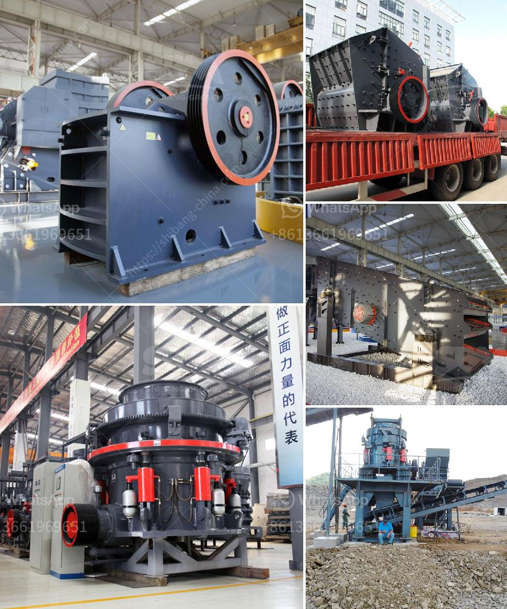

<h3>high efficient grinding mills for sale</h3>
Highly efficient grinding mills are essential in today's rapidly growing production industry. Whether you're in the mining, cement, or chemical industry, finding the right grinding mill for your operation is crucial to ensuring proper mineral liberation and energy efficiency.

Fortunately, there is a wide range of high efficient grinding mills available on the market, designed to meet diverse grinding requirements. These mills are equipped with advanced technologies and innovative features that enable them to achieve higher productivity and reduced energy consumption.

One of the popular grinding mills widely used in various industries is the ball mill. This type of mill is known for its robust construction and efficient grinding mechanism. It utilizes rotating balls to grind ores, minerals, and other materials to the desired particle size. The ball mill's design ensures easy installation and maintenance, making it a cost-effective choice for many businesses.

Another efficient grinding mill is the vertical roller mill, which is suitable for grinding materials with Mohs hardness below 9.3 and moisture content below 6%. This mill uses a unique grinding roller design to evenly distribute the grinding pressure, ensuring high grinding efficiency and reduced power consumption. Additionally, the vertical roller mill offers flexible operation and superior control over the grinding process.

When searching for high efficient grinding mills for sale, it's important to consider factors such as the mill's capacity, motor power, and the hardness of the materials you need to grind. It's also crucial to choose a mill from a reputable manufacturer that offers reliable after-sales support and spare parts availability.

In conclusion, high efficient grinding mills play a vital role in maximizing production efficiency and reducing operational costs. With various options available, finding the right grinding mill for your specific needs is now easier than ever. Invest in a high-quality grinding mill, and you'll enjoy enhanced productivity, energy efficiency, and overall profitability.
<h3>Contact us</h3><ul><li><strong>Whatsapp:&nbsp;<a href="https://wa.me/8613661969651">+8613661969651</a></strong></li><li><a href="https://swt.shibang-china.com/?git&amp;zhl&amp;high efficient grinding mills for sale"><strong>Online Service(chat now)</strong></a></li></ul><h3>Related</h3><ul><li><a href='mobile crushing and screening manufacturer in india.md'>mobile crushing and screening manufacturer in india</a></li><li><a href='cost for a metal crusher in kerala.md'>cost for a metal crusher in kerala</a></li><li><a href='pulverized ball mills.md'>pulverized ball mills</a></li><li><a href='gold wash plant for sale uk.md'>gold wash plant for sale uk</a></li><li><a href='small impact crusher 100 mesh.md'>small impact crusher 100 mesh</a></li></ul>