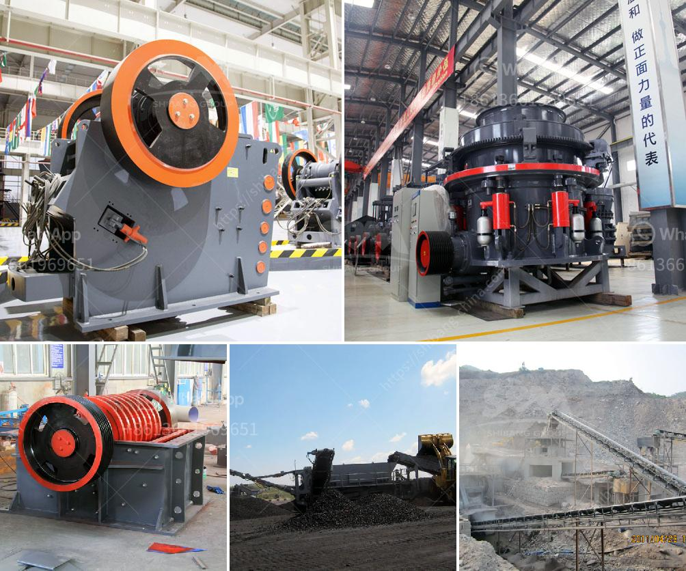

<h3>high grinding mill quicklime</h3>
Quicklime, also known as calcium oxide (CaO), is a key chemical compound used in numerous industrial applications such as building materials, metallurgy, chemical engineering, and environmental protection. To meet the growing demand for high-quality quicklime, the need for an efficient grinding mill arises. One such solution that has gained prominence is the high grinding mill for quicklime, offering various benefits and versatility across different industries.

The high grinding mill for quicklime is a technological breakthrough, designed to enhance the grinding process of this essential industrial compound. With its advanced features and precise operation, it offers significant advantages compared to traditional grinding mills. Let's delve into some key benefits that make it a preferred choice in various industries.

First and foremost, the high grinding mill ensures particle size reduction with unparalleled efficiency. Its advanced grinding mechanism, comprising high-speed rotating blades and a powerful motor, enables quicklime to be finely ground into smaller particles of precise dimensions. This enhanced grinding process results in improved chemical reactions, making quicklime suitable for a wide range of applications.

Moreover, the high grinding mill offers exceptional versatility, catering to the specific requirements of different industries. Whether it's the production of construction materials like cement and mortar or the utilization of quicklime in metallurgical processes, this mill can handle various applications with ease. Its adjustable grinding settings allow operators to achieve the desired particle size, making it adaptable to different manufacturing processes.

Another notable advantage of the high grinding mill for quicklime is its time-saving nature. With rapid grinding capabilities, it significantly reduces the processing time required to produce the desired fineness of quicklime. This not only enhances productivity but also improves the overall efficiency of industrial operations. Manufacturers can achieve higher production rates without compromising on the quality of quicklime.

Additionally, this advanced grinding mill ensures optimal utilization of raw materials. By thoroughly grinding quicklime, it maximizes the surface area available for chemical reactions, resulting in higher reactivity and improved product quality. This not only prevents wastage but also enhances the overall economic value of quicklime production.

Furthermore, the high grinding mill offers a precise control system, facilitating accurate adjustments in grinding parameters. From motor speed to blade rotation, operators can fine-tune various settings to achieve the desired grinding outcomes. This level of control ensures consistency in the quality of ground quicklime, maintaining the required specifications across batches.

Lastly, the high grinding mill for quicklime contributes to a greener environment. By efficiently grinding quicklime, it promotes resource conservation and minimizes waste generation. Moreover, its advanced filtration system effectively captures and collects any residual particles during the grinding process, preventing air pollution and creating a safer work environment.

In conclusion, the high grinding mill for quicklime is a valuable asset in the industrial sector, offering superior performance and versatility. Its efficient grinding mechanism, time-saving nature, versatility, precise control, and eco-friendly features make it an ideal choice for various industries. Manufacturers across different sectors can rely on this innovative technology to produce high-quality quicklime, meeting the diverse needs of their applications and contributing to their overall success.
<h3>Contact us</h3><ul><li><strong>Whatsapp:&nbsp;<a href="https://wa.me/8613661969651">+8613661969651</a></strong></li><li><a href="https://swt.shibang-china.com/?git&amp;zhl&amp;high grinding mill quicklime"><strong>Online Service(chat now)</strong></a></li></ul><h3>Related</h3><ul><li><a href='roller mill process machine.md'>roller mill process machine</a></li><li><a href='stone crusher sales company in kenya.md'>stone crusher sales company in kenya</a></li><li><a href='portable crushing and screening.md'>portable crushing and screening</a></li><li><a href='concrete waste crushing and iron.md'>concrete waste crushing and iron</a></li><li><a href='stone crushing machine in kenya.md'>stone crushing machine in kenya</a></li></ul>