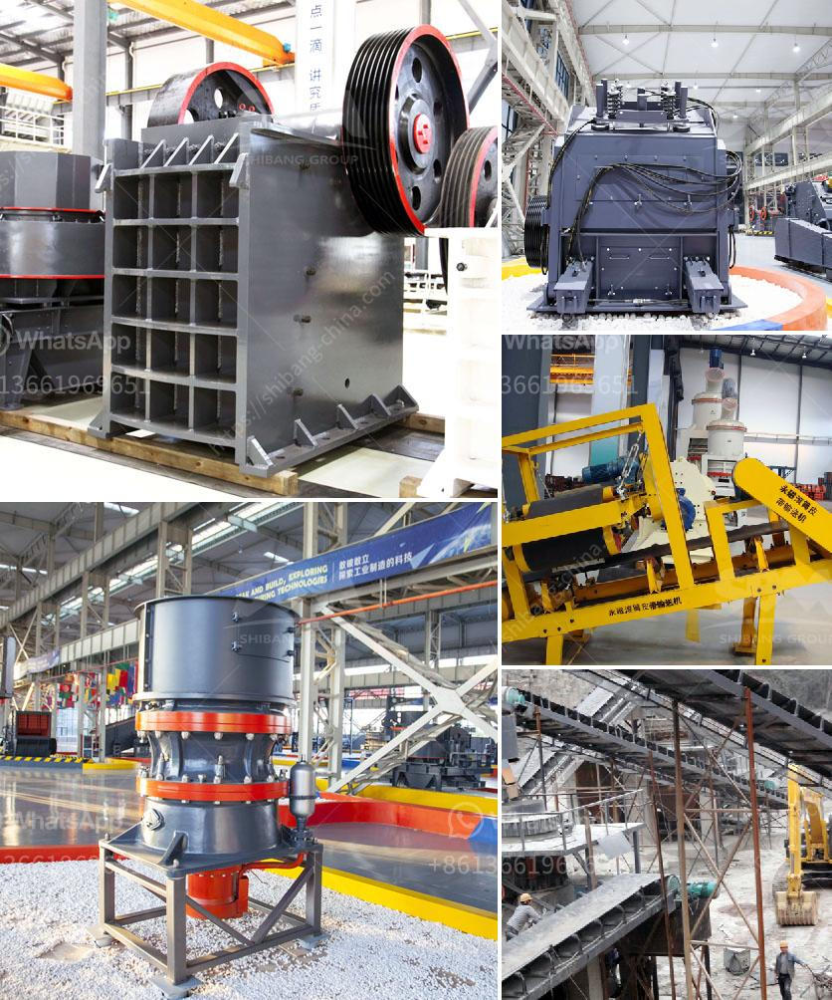

<h3>high reversible mill with 750 mm diameter rolls</h3>
Steel rolling mills play a vital role in various industries, such as automotive, construction, and manufacturing, by converting raw materials into precise, high-quality metal sheets. One essential component of these mills is the rolling mill rolls, which determine the final shape and thickness of the rolled metal.

Among various configurations, the high reversible mill with 750 mm diameter rolls has emerged as a popular choice for its exceptional performance and efficiency. This cutting-edge mill design incorporates several unique features that contribute to its superiority in steel rolling.

First and foremost, the 750 mm diameter rolls provide enhanced productivity by allowing a higher throughput of metal sheets. The larger roll diameter ensures a wider contact area with the metal, resulting in a more efficient rolling process with improved material flow. This enables mills to achieve higher production rates while maintaining superior product quality.

Furthermore, the reversible feature of these mills proves to be a significant advantage. In traditional rolling mills, the rolls are fixed in a unidirectional arrangement, which limits their versatility. Conversely, a reversible rolling mill, as the name suggests, allows the rolls to rotate in both directions. This versatility not only enables mills to perform multi-pass rolling operations but also allows for easy roll changes, reducing downtime and increasing overall efficiency.

With advanced technologies and automation systems, high reversible mills with 750 mm diameter rolls provide precise control over the rolling process. Automated controls enable operators to adjust critical parameters, such as roll gap, rotational speed, and rolling force, ensuring accurate thickness control and excellent product quality. Moreover, sophisticated real-time monitoring systems allow for quick identification and rectification of any deviations, minimizing defects and optimizing the overall production output.

In conclusion, the emergence of high reversible mills with 750 mm diameter rolls has revolutionized the steel rolling industry by offering increased productivity, versatility, and advanced control. As the demand for superior metal sheets continues to grow, these mills have proven to be an indispensable asset in achieving higher efficiency, cost-effectiveness, and excellent product quality.
<h3>Contact us</h3><ul><li><strong>Whatsapp:&nbsp;<a href="https://wa.me/8613661969651">+8613661969651</a></strong></li><li><a href="https://swt.shibang-china.com/?git&amp;zhl&amp;high reversible mill with 750 mm diameter rolls"><strong>Online Service(chat now)</strong></a></li></ul><h3>Related</h3><ul><li><a href='used quarry equipment from usa.md'>used quarry equipment from usa</a></li><li><a href='coal mining machines in india.md'>coal mining machines in india</a></li><li><a href='buy gold crusher machine.md'>buy gold crusher machine</a></li><li><a href='mobile crushers for sale in nigeria.md'>mobile crushers for sale in nigeria</a></li><li><a href='quarry crusher machine equipment in germany prices.md'>quarry crusher machine equipment in germany prices</a></li></ul>