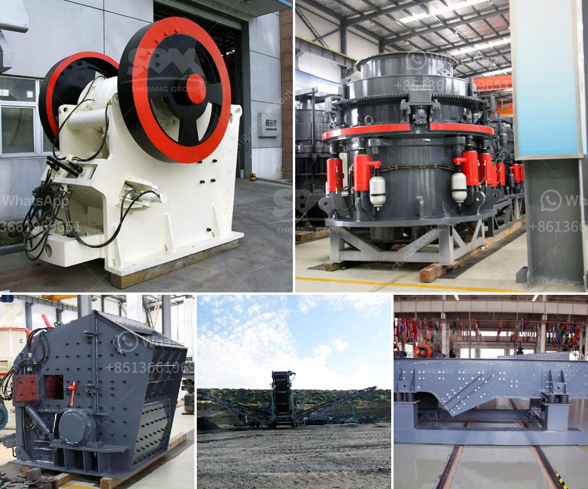

<h3>hot used trommel screen machine in sand</h3>
The trommel screen machine has become an essential tool in sand processing plants worldwide. With its ability to effectively separate materials based on their size, the trommel screen machine has gained significant popularity in the sand industry. This article aims to highlight the reasons behind the popularity of the hot used trommel screen machines in sand processing.

Firstly, the trommel screen machine offers a high level of efficiency in separating different-sized materials. The machine consists of a cylindrical drum that rotates on its axis, allowing the smaller particles to fall through while the larger particles are retained and conveyed to the end of the drum. This process ensures that the sand is properly graded and eliminates the need for manual sorting. As a result, the trommel screen machine greatly improves the overall productivity of sand processing plants.

Another reason for the popularity of the trommel screen machine is its versatility in handling various types of materials. The machine can efficiently separate different sizes of sand, gravel, and other aggregates. Additionally, it can handle wet or dry materials, making it suitable for use in diverse sand processing applications. The ability to process different materials effortlessly makes the trommel screen machine a valuable asset for sand producers.

Moreover, the trommel screen machine is known for its robust construction and durability. The machine is typically built with high-quality materials, enabling it to withstand the harsh conditions in sand processing plants. The drum and other components are designed to handle heavy loads and resist wear and tear. This durability ensures that the trommel screen machine operates efficiently for an extended period, minimizing downtime and maintenance costs.

Additionally, the trommel screen machine offers easy and convenient operation. The control panel allows users to adjust the speed and inclination of the drum, ensuring optimal performance for each specific application. The machine can also be easily integrated into existing sand processing plants, requiring minimal modification. This user-friendly design makes the trommel screen machine a practical choice for sand producers of all sizes.

Lastly, the trommel screen machine is environmentally friendly. By efficiently separating materials, the machine reduces the need for excessive extraction and processing of sand. This helps to conserve natural resources and minimize the environmental impact of sand mining operations. Additionally, the machine can be equipped with dust suppression systems, further reducing the release of airborne particles.

In conclusion, the hot used trommel screen machine has become a popular choice in the sand processing industry due to its efficiency, versatility, durability, ease of operation, and environmental benefits. As sand producers strive to optimize their operations and meet increasing demands, the trommel screen machine has proven to be an essential tool. With its ability to effectively separate materials and improve overall productivity, the trommel screen machine continues to play a crucial role in the sand processing industry.
<h3>Contact us</h3><ul><li><strong>Whatsapp:&nbsp;<a href="https://wa.me/8613661969651">+8613661969651</a></strong></li><li><a href="https://swt.shibang-china.com/?git&amp;zhl&amp;hot used trommel screen machine in sand"><strong>Online Service(chat now)</strong></a></li></ul><h3>Related</h3><ul><li><a href='stone crushers hydraulic.md'>stone crushers hydraulic</a></li><li><a href='bauxite production line.md'>bauxite production line</a></li><li><a href='factory price tile adhesive manufacturing plant.md'>factory price tile adhesive manufacturing plant</a></li><li><a href='mobile crusher line.md'>mobile crusher line</a></li><li><a href='clay crusher processing in india.md'>clay crusher processing in india</a></li></ul>