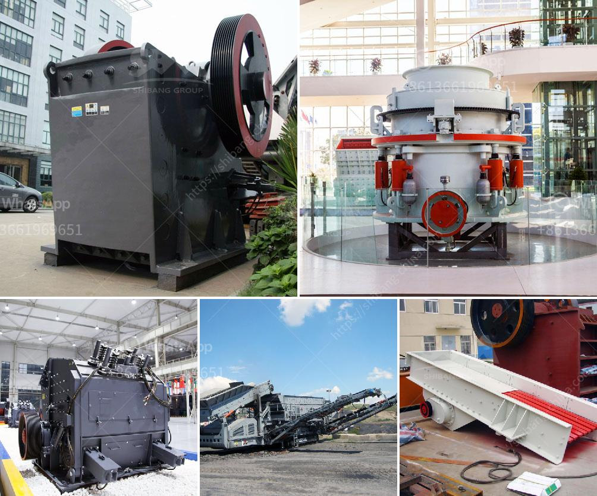

<h3>how much capital required for starting marble factory</h3>
Marble, with its exquisite beauty and timeless appeal, has been a symbol of luxury and grandeur for centuries. If you have a passion for this elegant stone and a desire to start your own marble factory, you are embarking on a potentially lucrative business venture. However, it is crucial to have a clear understanding of the capital required to establish and sustain such a venture. In this article, we will explore the key considerations and approximate capital requirements for starting a marble factory.

To begin with, the capital requirements for a marble factory can vary significantly based on various factors such as the scale of the operation, equipment needed, location, and market demand. The factory can range from a small, artisanal setup to a large-scale industrial unit catering to commercial and residential projects. Hence, it is essential to define the scale and scope of your marble factory to estimate the required financial resources accurately.

First and foremost, the cost of acquiring or leasing a suitable factory space needs to be considered. An industrial space with enough room for the production of marble slabs, storage, and office administration is essential. The cost can vary depending on the location, size, and infrastructure amenities available. A rough estimate for a medium-sized marble factory would be between $50,000 to $200,000.

Next, the procurement of necessary machinery and equipment is a crucial capital expense. This includes machines for cutting, shaping, and polishing marble, as well as specialized tools and consumables. The cost of these machinery items can range from $100,000 to $500,000, depending on the scale and technological sophistication desired. It is advisable to research and consult industry experts to ensure that the equipment chosen is of good quality, reliable, and efficient.

Another significant capital requirement is the raw material itself, i.e., the marble blocks. The cost of marble blocks will depend on various factors such as quality, rarity, and source. Building relationships with reliable suppliers or investing in mining operations can help reduce procurement costs. A substantial initial investment may be required to maintain a steady supply of high-quality marble blocks, ranging from $100,000 to $500,000.

Furthermore, as with any business, it is essential to consider working capital requirements. These include expenses for utilities, salaries and wages of employees, marketing, transportation, administrative costs, and contingencies. It is advisable to have sufficient funds to cover at least six to twelve months of operating expenses, which can typically amount to $100,000 or more, depending on the size of your operation.

Lastly, compliance and licensing costs must not be overlooked. Depending on your jurisdiction, obtaining permits, licenses, and certifications related to environment, safety, quality standards, and labor regulations may be necessary. Engaging legal and regulatory experts will help estimate these costs accurately.

Starting a marble factory can be a financially rewarding endeavor, but it requires careful planning and a realistic assessment of capital requirements. A medium-sized marble factory may need an investment ranging from $400,000 to $1.5 million, but this can vary significantly depending on the factors mentioned above. It is crucial to conduct a comprehensive feasibility study, seek professional advice, and create a robust business plan to secure necessary funding from investors or financial institutions.

In conclusion, the capital required for starting a marble factory depends on the scale of the operation, equipment needed, quality of marble blocks, factory space, and other factors. While setting up a marble factory involves a significant initial investment, with proper planning, market analysis, and execution, it can lead to a profitable and sustainable business venture in the long run.
<h3>Contact us</h3><ul><li><strong>Whatsapp:&nbsp;<a href="https://wa.me/8613661969651">+8613661969651</a></strong></li><li><a href="https://swt.shibang-china.com/?git&amp;zhl&amp;how much capital required for starting marble factory"><strong>Online Service(chat now)</strong></a></li></ul><h3>Related</h3><ul><li><a href='rock crusher in philippines.md'>rock crusher in philippines</a></li><li><a href='crusher jaw crusher 6x8 jaw.md'>crusher jaw crusher 6x8 jaw</a></li><li><a href='mineral processing ball mills nigeria.md'>mineral processing ball mills nigeria</a></li><li><a href='stone manufacturing process.md'>stone manufacturing process</a></li><li><a href='drums for conveyor belts.md'>drums for conveyor belts</a></li></ul>