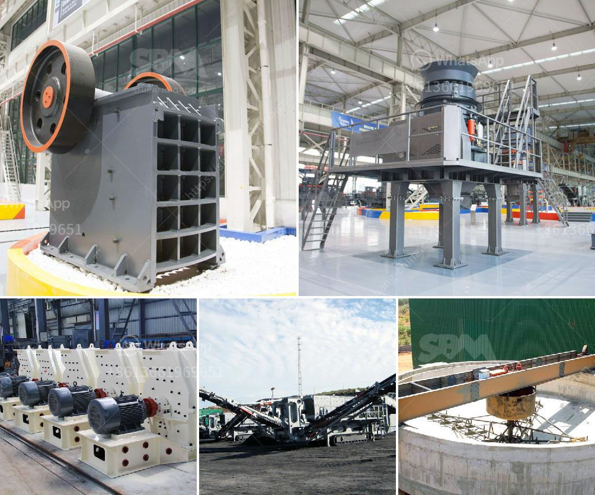

<h3>how much do rock crushers cost</h3>
Rock crushers are a staple in construction, mining, and aggregate production. But how much do rock crushers cost? It's not a straightforward answer, as there are many factors that will determine the price tag on these powerful machines.

Firstly, the type of rock crusher is a key factor in determining its price. Different types of rock crushers, such as cone crushers, jaw crushers, and impact crushers, have different capacities, feed sizes, and performance levels. Cone crushers are typically used for secondary or tertiary crushing, where materials are reduced to finer sizes. Jaw crushers, on the other hand, are primarily used for primary crushing, where larger rocks are broken down into smaller pieces. Finally, impact crushers are used for crushing softer materials like limestone or recycled concrete.

Once you have identified the type of rock crusher you need, the next factor to consider is the size or capacity of the machine. Smaller rock crushers with low capacity will obviously cost less than large-capacity crushers. However, this also means that you may need to invest in additional equipment to feed the crushing plant or move the rock materials to the crusher. On the other hand, larger rock crushers can handle higher volumes of material, but they come with a higher price tag.

The specific features and specifications of a rock crusher will also impact its cost. For instance, a rock crusher with an automated control system, a hydraulic setting adjustment, a tramp release system, and other advanced features will typically cost more than a basic model. Additional features, such as a screen and conveyor system, may also add to the overall cost. These features, however, can greatly enhance the efficiency and productivity of the crusher, making it worth the investment in the long run.

Apart from the initial purchase cost, it's important to consider the operating and maintenance costs associated with rock crushers. Fuel consumption, electricity usage, and labor costs are all important factors to take into account. Additionally, the type and availability of spare parts can impact the maintenance cost of the crusher. It's essential to choose a reliable manufacturer or supplier who provides high-quality parts at a reasonable price.

The location and transport logistics should also be considered when estimating the cost of a rock crusher. If the crusher needs to be transported long distances, the shipping costs can significantly add to the overall expenses. Furthermore, local regulations and permits may also affect the cost of operating a crusher, especially if it requires specialized equipment or additional personnel.

To summarize, the cost of rock crushers can vary greatly depending on several factors. The type, size, and features of the crusher, as well as the operating and maintenance costs, will all contribute to the final price. It's crucial to evaluate your specific needs and budget before investing in a rock crusher to ensure that you choose the most cost-effective solution for your operations.
<h3>Contact us</h3><ul><li><strong>Whatsapp:&nbsp;<a href="https://wa.me/8613661969651">+8613661969651</a></strong></li><li><a href="https://swt.shibang-china.com/?git&amp;zhl&amp;how much do rock crushers cost"><strong>Online Service(chat now)</strong></a></li></ul><h3>Related</h3><ul><li><a href='type of quarry crusher equipment.md'>type of quarry crusher equipment</a></li><li><a href='coal washing machine for sale.md'>coal washing machine for sale</a></li><li><a href='cone crushers to rent south africa.md'>cone crushers to rent south africa</a></li><li><a href='mobile gold crusher plant.md'>mobile gold crusher plant</a></li><li><a href='stone crusher from china.md'>stone crusher from china</a></li></ul>